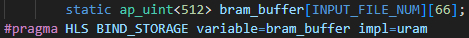
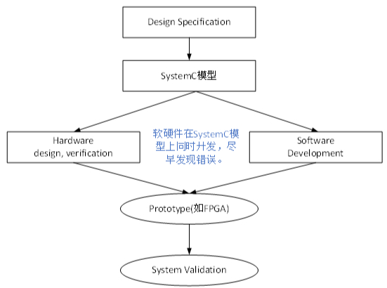
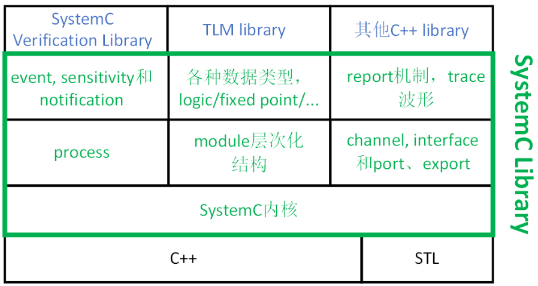

## 目录
* [1.HLS简介](#1.HLS简介)
* [2.制导语句和约束](#2.制导语句和约束)
* [3.SystemC](#3.SystemC)
* [4.Verilog和VHDL](#4.Verilog和VHDL)
* [5.Verilog和C的区别](#5.Verilog和C的区别)

****
# 1.HLS简介
**HLS（High Level Synthesis）**，高层次综合工具，可以使用户通过添加[制导语句（directives）和约束（constrains）](#2.制导语句和约束)，将C/C++/[System C](#3.SystemC)代码直接转为FPGA RTL（[Verilog，VHDL](#4.Verilog和VHDL)，SystemC）代码。

	Xilinx最新的HLS设计工具已经从Vivado HLS改为Vitis HLS
	
Vitis HLS支持将C、C++和OpenCL函数硬连线到器件逻辑互连结构和RAM/DSP块上。

****
# 2.制导语句和约束
**制导语句（directives、指导语句）**，依赖于源程序，开发中会在源程序中加入一些类似于注释的语句，称为制导语句。特别的在C语言中，可以使用 **#pragma** 来标记制导语句。常见的标准为OpenMP，较新的还有OpenACC、OpenHMPP。

**在适合并行的地方加入制导语句，可以提高计算设备的效能比**。

约束（constrains），根据目标设备的资源限制，设置合适的资源约束，以限制资源使用量并优化性能。

****
# 3.SystemC
**系统建模语言**，基于C++开发的开源library，理论上和常见的boost库没有任何差别。只要环境支持C++，就可以进行SystemC建模和仿真。可以让软硬件并行开发，加快产品面世，其特点包括：
* 硬件架构探索，建立算法、性能模型；
* 验证工程师作为参考模型（通过DPI接口调用）；
* 设计工程师将其作为design spec，设计RTL；
* 软件工程师作为软件开发的硬件模型；
* 使多种提前测试成为可能；

在软硬件设计之前先开发**System C模型**（如TLM模型），**硬件部门将模型转化为RTL（寄存器传输级），软件部门在此模型上开发软件**，这样软硬件的任何错误都能被尽早发现。

	  TLM模型在各组件之间建立一个专用通道，让信息只在这个通道里流动，
	  因此避免了全局变量，public成员变量和config机制通讯时带来的不便

&emsp;&emsp;[图源-SystemC简介](https://blog.csdn.net/gsjthxy/article/details/126099348)

下图为SystemC框架图，**底层是C++及其标准库**，也可包括其他的C++库，如boost库。

**SystemC library**包含多种功能，最核心的有如下几项：
* **SystemC内核**：用于调度SystemC process，功能和Verilog、VHDL仿真内核非常相似；可以认为类似于Linux内核的极度简化版本。
* **SystemC process**：由用户定义，模拟硬件和软件的行为。其并行运行，由SystemC内核调度执行。
* **SystemC event**：在特定时间点发生的事件，SystemC内核和Verilog仿真内核一样是事件驱动型内核。
* **SystemC module**：用于将建模对象模块化、层次化；
* **SystemC channel/interface/port/export**：用于实现模块间通信

&emsp;&emsp;[图源-SystemC简介](https://blog.csdn.net/gsjthxy/article/details/126099348)

****
# 4.Verilog和VHDL
**HDL（Hardware Description Language，硬件描述语言）**，以文本形式描述数字系统硬件的结构和行为的语言，可以表示逻辑电路图、逻辑表达式，还可以表示数字逻辑系统所完成的逻辑功能。
Verilog HDL和VHDL是最流行的两种HDL。

**Verilog HDL和VHDL（Very-High-Speed Integrated Circuit Hardware Description Language，超高速集成电路硬件描述语言）** 是世界上最流行的两种硬件描述语言，都是在20世纪80年代中期开发出来的。前者由Gateway Design Automation公司（该公司于1989年被Cadence公司收购）开发，后者为美国军方组织开发。两种HDL均为IEEE标准。

	Tip: 中国、日本、美国大部分采用Verilog，而VHDL在欧洲应用较广泛
	
Verilog可以从五个层次对电路（系统）进行描述，包括:系统级、算法级、**寄存器传输级（即RTL级）**、门级、开关级。我们平时用的最多的为RTL级，故**Verilog代码也经常被称为RTL代码**。

****
# 5.Verilog和C的区别

**Verilog 是硬件描述语言**，在编译下载到 FPGA 之后，FPGA 会生成电路，所以 **Verilog 全部是并行处理与运行的**；**C 语言是软件语言**，编译下载到单片机/CPU 之后，还是软件指令，而单片机/CPU 处理软件指令需要取址、译码、执行，是**串行执行**的。

**Verilog 和 C 的区别也是 FPGA 和单片机/CPU 的区别**，由于 FPGA 全部并行处理，所以处理速度非常快，这个是 FPGA 的最大优势，这一点是单片机/CPU 替代不了的。

此外，Verilog学习难度要高得多（那是肯定的）。
