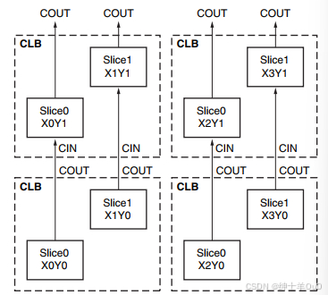

==看前提醒：作者入门尚浅，本文基本是找到的教程的简略版笔记，本文主要为学习[作者：Jasper兰](https://blog.csdn.net/suiyaopu8894?type=blog)的FPGA教程系列，并结合部分学习中查找的其他资料整理而成。==
## 目录
* [1.可配置逻辑块](#1.可配置逻辑块)
* [2.SLICE组成简介](#2.SLICE组成简介)
* [3.LUT](#3.LUT)
* [4.DRAM](#4.DRAM)
* [5.MUX](#5.MUX)
* [6.进位链](#6.进位链)
* [7.存储单元](#7.存储单元)
* [8.SLICE和CLB](#8.SLICE和CLB)
* [9.DSP48E1](#9.DSP48E1)
* [10.BRAM](#10.BRAM)

---
# 1.可配置逻辑块
&emsp;&emsp; **可配置逻辑块（Configurable Logic Block，CLB）** 是FPGA芯片的底层元件之一，如果将FPGA比作人体，那么CLB就是组成人体的细胞。

<div align="center">  </div>

&emsp;&emsp; <font color=red>**CLB由SLICE组成**</font>，不同架构的SLICE种类不一样，Xilinx7系中就有两种SLICE：**SLICEL、SLICEM**，SLICEM比SLICEL多了写存储数据功能。

---
# 2.SLICE组成简介
FPGA每个SLICE基本都由**LUT、MUX、进位链、寄存器**组成：
* LUT（look up table）：查找表
* MUX（Multiplexer）：多路选择器
* 进位链：用于实现全加器
* 寄存器：同步数据，常用于打拍

&emsp;&emsp;下图为SLICEM的组成结构，==<font color=red>**SLICEL与SLICEM的差别仅在于SLICEM的4个LUT6具有存储功能，而SLICEL没有**</font>==。

&emsp;&emsp;对于整体结构在本小节仅做了解，在本文做完各组件介绍后会对整体结构进一步分析。

<div align="center">  </div>

---
# 3.LUT
&emsp;&emsp;**查找表（Look Up Table, LUT）**，FPGA以LUT代替门电路，任意一个 **6位输入1位输出（6IN-1OUT）** 的门电路，都可以用LUT6来表示。<font color=red>**LUT6本质是64*1的ROM（Read Only Memory）**</font>，深度为64，位宽为1，将6位输入当做6位地址线，则输出就是当前地址存储位。

<div align="center">  </div>

&emsp;&emsp;**LUT6本质由2个LUT5（5IN-1OUT）组成**，首先两个LUT5分别对I[4:0]指定真值表，此时对于l[4:0]会分别有2位输出，这2位输出再经过由I5控制的选择器（MUX）输出为O6，即可实现LUT6。此时O5会输出上方LUT5的结果，但一般只在LUT6用作5位输入2位输出时使用。

&emsp;&emsp;**LUT6可以用作5位输入2位输出（5IN-2OUT）**，使用此功能时I5将强制置1，使O6的输出为下方LUT5的输出。

<div align="center">  </div>

在实际情况中：
* ==输出是1位，并且输入小于等于6位时==，仅需**无视高位填LUT6真值表**，再写入LUT6即可
* ==输入大于1位，或输入比6位多时==，则用**多个LUT6并行处理**，这会使多个输入途径多条路径，而路径之间延迟难以一致，此时需要使用<font color=red>**寄存器**</font>来进行同步。

---
# 4.DRAM
下图中，左侧为SLICEM，右侧为SLICEL，二者仅红框部分，也就是LUT6部分不同。

<div align="center">  </div>

对比SLICEM和SLICEL的LUT6，其异同点如下：

* 相同点：都具有地址输入线（A1-A6），2个输入口（O5-O6）
* 不同点：SLICEM的LUT6具有写地址输入线（WA1-WA8），写数据端（DI1-DI2），写使能端（WE）

<div align="center">  </div>

因为SLICEM的LUT6具有写存储功能，因此LUT6可以作RAM使用，1个SLICEM中有4个LUT6，**可以组合为多种DRAM（Distributed RAM，分布式随机存储器）**：
* 32x1或64x1的单端口DRAM，1个LUT6
* 32x1或64x1的双端口DRAM，2个LUT6
* 32x6或64x3的简单双端口DRAM，4个LUT6
* 32x2或64x1的四端口DRAM，4个LUT6

配合**MUX**使用可以组成**更大深度的DRAM**：

* 128x1的单端口DRAM，2个LUT6+1个MUX
* 128x1的双端口DRAM，4个LUT6+2个MUX
* 256x1的单端口DRAM，4个LUT6+3个MUX

### 单端口DRAM
&emsp;&emsp;同步读，同步写，DI1数据输入，A[5:0]指定地址，WE置高写数据，WE置低读数据

<div align="center">  </div>

### 双端口DRAM
&emsp;&emsp;一个端口可同步写（通过A[5:0]指定两个LUT6的地址同时写入）、异步读，另一个端口只能异步读。上方LUT6通过A[5:0]指定读取地址，下方LUT6通过DPRA[5:0]指定读取地址。

<div align="center">  </div>

### 简单双端口DRAM
&emsp;&emsp;一个端口WADDR[6:1]只可同步写，另一端口RADDR[6:1]只可异步读。64x3简单双端口DRAM（左图）可以存储64个3位数据，DATA[3:1]并行输入，三个O6（O[3:1]）并行输出；32*6可以存储32个6位数据，DATA[6:1]输入，O[6:1]输出。

<div align="center">  </div>

### 四端口DRAM
&emsp;&emsp;一个端口（ADDRD）可同步读、异步写，其他三个端口（ADDRA、ADDRB、ADDRC）仅可异步读，与双端口类似，四个LUT存相同数据，但每个端口都能各自读不同地址内容（提高并发读取性能）。

<div align="center">  </div>

### 128x1单端口DRAM
&emsp;&emsp;由2个64x1单端口DRAM+1个MUX组成。写入时A[6:0]用于指定地址WA[7:1]；读取时A[5:0]用于指定地址，A[6]用于MUX选择控制。

<div align="center">  </div>

### 32位移位寄存器
&emsp;&emsp;SRLC32E，使用SLICEM的LUT配置为32位移位寄存器。移位寄存器中的数据在脉冲信号作用下依次逐位移动，因此每个LUT可以将串行数据延迟1到32个时钟周期。移位寄存器使用电平转移，即输入是多少V输出就是多少V，因此可能出现亚稳态电平。

<div align="center">  </div>

> 移位寄存器较复杂，参考资料：
> &emsp;&emsp;https://blog.csdn.net/qq_43433724/article/details/137976382
> &emsp;&emsp;https://blog.csdn.net/lsh11111/article/details/136158623
> &emsp;&emsp;https://blog.csdn.net/apple_53311083/article/details/132259262

移位寄存器的应用包括：
* 延迟或延迟补偿
* 同步FIFO和内容可寻址存储器（CAM）

移位寄存器功能包括：
* 写入操作
* 动态读取访问
  * 通过5位地址总线A[4:0]执行
  * 通过改变地址，可以异步读出32位中的任何一位（在O6 LUT输出端，在基元上称为Q）
  * 此功能在创建较小的移位寄存器（小于32位）时非常有用。
&emsp;&emsp;——例如，在构建13位移位寄存器时，将地址设置为第13位。
  * 存储元件或触发器可用于实现同步读取。
&emsp;&emsp;——触发器的时钟输出决定了整体延迟并提高了性能。
&emsp;&emsp;——但是增加了一个额外的时钟延迟周期。
* 不支持设置或重置移位寄存器。

移位寄存器时序图

<div align="center">  </div>

---
# 5.MUX
&emsp;&emsp;**多路选择器（Multiplexer，MUX）**，如下图为四选一数据选择器（MUX4_1），由2位地址码A[1:0]选择将数据输入D[3:0]的其中一位传送到输出。因为也是6位输入1位输出，所以**MUX4_1本质上也是LUT6**，只不过它有着特定的连线方式

<div align="center">  </div>


&emsp;&emsp;**MUX8_1由2个LUT6和一个MUXF7组成**，其原理图如下。低2位地址线a[1:0]（黄线和蓝线）分别连接到2两个LUT6的同一位置，高1位a[2]（红线）用于连接MUXF7进行数据选择；8位数据输入d[7:0]分别经过2个LUT6进行4选1，最终由MUXF7进行2选1。

<div align="center">  </div>


&emsp;&emsp;**MUX16_1与MUX8_1类似**，先通过4个MUX4_1从16个数据选出4个（低2位地址），再通过2个MUXF7选出2个（次高位地址），最后通过MUXF8进行2选1（最高位地址）。

<div align="center">  </div>


&emsp;&emsp;MUX16_1中没有使用LUT6进行5次4选1（原：16-4-2-1，5次4选1：16-4-1），下图中，红线是使用5个LUT6进行16选1，绿线是通过4个LUT6+MUX进行16选1。可以看出**红线路径无法保证延迟一致性**，走线越长延迟偏差就越大，容易产生毛刺，造成逻辑错误。这也是MUXF7和MUXF8这样设计（靠近LUT6，且结构对称）的原因，<font color=red>**其本身就是为多路选择器设计的**</font>。

<div align="center">  </div>

---

# 6.进位链
基础补充：全加器。
全加器最低位CIN置1为减法，如0101-0010=0011，0101补码不变，(-0010)补码为反码+1，将0101和0010的反码传入，CIN置1即为反码+1操作，等价于0101+1110=0011。

进位链结构如下，红框部分为它的一个基本单元（本质为全加器）。

* CIN=进位输入（当它在最低位时，置0做加法，置1做减法）
* S0=A0⊕B0，它来自LUTA（作为LUT2使用）的O6
* O0=S0⊕CIN=A0⊕B0⊕CIN（相当于是全加器的S），它来自LUTA的O5或外面外部输入AX
* DI0 = A0或者B0（两个加数中的一个，配合S0使用）

<div align="center">  </div>


**MUXCY（下一级进位）原理：**

产生进位的条件是在A、B以及CIN中有两个或两个以上的1，分为两种情况：
* **S0=0**时，可能两个加数都为0（此时进位为0）或两个加数都为1（此时进位为1），因此**MUXCY选择DI0（两个加数的任意一个）作为进位输出（CO0）**。此时不需要管上一级进位，因为0+1=1，不会产生进位。
* **S0=1**时，即A0与B0中有1个为1，此时如果上一级进位为1则进位输出为1，否则不进位，即上一级进位CIN和进位输出CO相同，因此**MUXCY选择上一级进位（CIN0）作为进位输出（CO0）**。

**以一个8位加法为例子：**

```c
module carrychain(
    input [7:0] a,
    input [7:0] b,
    output[7:0] o
    );
    
assign o=a+b;
endmodule
```

&emsp;&emsp;因为**1个LUT6只能作为4位全加器使用**，所以会使用到2个LUT6，其内部连线如下。a和b的低4位传到了红框中，结果传入进位链1，第4位进位传到进位链2，并输出低4位运算结果o[3:0]；高4位传到绿框中，结果传入进位链2，最终输出高4位运算结果o[7:4]。

<div align="center">  </div>

&emsp;&emsp;进位链级联数有限制，其取决于当前列SLICE的个数（图中绿框部分），且不能跨逻辑区域，逻辑区域里进位链最大级数=逻辑区域内一列的SLICE个数，全加器位宽为SLICE个数x4。

<div align="center">  </div>

---
# 7.存储单元
基础补充：触发器，通过时钟沿到来改变存储的输出状态；锁存器，通过电平变换改变存储的输出状态。FPGA中触发器使用较多。
* 触发器特性：在下一次时钟沿到来之前，输出Q不变，时钟沿触发时，输出D的电平转移到Q。以3.3VMOS为例，输入电平高于高电平阈值2.0V时，Q输出高电平3.3V，输入低于低电平阈值0.7V时，Q输出低电平0V。相比LUT移位寄存器的电平转移，触发器可以降低亚稳态的影响（如2.1V、0.7V）。

**Xilinx7系的存储单元结构主要分两种，如下图存储单元1、2：**

<div align="center">  </div>

相同点：
* 有数据输入端D、时钟使能端CE、时钟输入端CK、复位端SR
* 能通过配置INIT1、INIT0，将上电/全局复位后的初始电平置为高或低
* 能通过配置SRHIGH、SRLOW来控制用户复位后的电平（推荐高电平复位，因为无需额外资源消耗，低电平还需要加个LUT做反相，如下图所示）
* 同一SLICE中，同一类型存储单元的用户复位可以配置为同步或异步复位。

<div align="center">  </div>

```c
例1：INIT和SR复位电平的配置
module and_8_8(
    input clk,
    input rst,
    input [7:0]i_data_1,
    input [7:0]i_data_2,
    output[7:0]o_data
    );
    
reg [7:0]r_data_tmp=8'b0; //这里将会8个存储单元配置为INIT0 ,如果改成8'b1111_1111则配置成INIT1
always@(posedge clk)
begin
    if(rst)
        r_data_tmp<=8'b0;//这里将会8个存储单元配置为SRLOW ,如果改成8'b1111_1111则配置成SRHIGH
    else
        r_data_tmp<=i_data_1&i_data_2;
end
 
assign o_data=r_data_tmp;
endmodule
```

不同点：
* 存储单元1只能做触发器，存储单元2既能做触发器也能做锁存器。
* 存储单元1只能由外部旁路输入或所在行LUT6的O5输出作为输入。存储单元2在1的基础上，还能
* 所在行LUT6的O6输出、MUX7/8的输出、进位链的输出作为输入。

---
# 8.SLICE和CLB
小节2中给出过的SLICEM架构图如下，可以分为相同的4行，SLICEL与之类似，差别仅为LUT6不具备存储功能。

<div align="center">  </div>

* **蓝紫框为存储单元1、2**，verilog中每1位reg几乎都会用到1个存储单元。输入取决于单元前的MUX，存储单元1有2种输入方式，存储单元2有6种输入方式。
* **红框为LUT6**，内部由2个LUT5和1个MUX组成，可以实现6入1出、5入2出、4选1功能。SLICEM中还可以做DRAM、移位寄存器以实现数据读写、移位输出功能。
* **橙黄框为MUXF7、MUXF8**，将LUT拼接为更大深度的LUT、DRAM或移位寄存器（MUX不会增加数据宽度）
* **绿框为进位链**，实现多位加法器功能，位宽取决于逻辑区域列高。
* **接近输出的为MUX（A/B/C/DMUX输出）**，与存储单元2前的MUX特性类似，接收6个输入，有5个输入连在一起，只不过第一个是直接输出，第二个打一拍再输出；第一个MUX不接受外部旁路输入，接收存储单元1的输出作为输入。（两个MUX都没有数据选择端，运行时的输出是确定的）

SLICE在CLB中的排列：
&emsp;&emsp;一个CLB有2个SLICE，上一级SLICE进位链输出连接到下一级SLICE进位链输入。

<div align="center">  </div>

进位之外数据的互联：
&emsp;&emsp;同一CLB内的SLICE通过CLB内的快速互联单元（橙框）直连，黄框和绿框用于将线连到更远处。

<div align="center">  </div>

---
# 9.DSP48E1
DSP48E1可以用于进行多种逻辑、算术的单独、组合运算，内容较多，仅作简要总结。DSP48E1的简要架构如下：
<div align="center">  </div>

红框之外的部件为寄存器，用于流水线操作，提高性能
1. 预加器（加法器），实现A（最大位宽30）与D（最大位宽25）的相加，输出结果最大位宽25，不使用时可以旁路掉。
2. 25x18乘法器，B（最大位宽18）与AD相加结果相乘为48位结果（高5位为符号拓展位，低43位为数据位），不用时可以旁路掉。
3. 可以做加（减）法器，累加（减）法器，逻辑运算（与或非），输出最大位宽48位+4位进位
4. 模式探测器，带掩码的数据比较、上下溢出检测、一定计数时重置结果。
5. 数据选择器，两个输入端为C和P（最大位宽48），DSP48E1做加法或累加取决于它，真实的DSP48E1有很多数据选择器，与实现功能密切相关。

**DSP48E1的内部架构：**

<div align="center">  </div>

&emsp;&emsp;DSP48E1除了能做1个48位与48位加法/减法/逻辑操作（ONE48），还能被用来做2个24位与24位加法(TWO24)，4个12位与12位加法(FOUR12)

<div align="center">  </div>

**模式探测器**

&emsp;&emsp;输入主要为PATTERN，MASK，DATA，DATA为DSP48E1运算后未打拍的结果。使用PATTERN DETECT时输出要打一拍，与输出P对应上。

&emsp;&emsp;当DATA与PATTERN相同时，PATTERNDETECT为1，否则为0；当DATA与PATTERN反码相同时，PATTERNBDETECT为1，否则为0。MASK对应DATA每一位，置1时，对应位忽略与PATTERN的比较，当数据位全置1时，PATTERNDETECT用于检测高位（符号拓展位）是否全为0，不是的话产生上溢出（overflow），PATTERNBDETECT用于检测高位是否全为1，不是的话产生下溢出。

<div align="center">  </div>

---
# 10.BRAM
&emsp;&emsp;一般来说，**存储较大数据时用BRAM，存储较小数据时用DRAM**，分界线并不严格，跑通就行。

&emsp;&emsp;BRAM有 **单口（Single Port，SP），简单双端口（Single Dual Port，SDP），真双端口（True Dual Port，TDP）** 等，与DRAM类似。

&emsp;&emsp;在读操作时，==**DRAM是组合逻辑直接输出，而BRAM是时序逻辑输出**==，所以送地址进DRAM时不需要时钟，BRAM输入地址需要过寄存器，也就是需要时钟才能输出。此外BRAM输出内嵌一个寄存器，打拍输出时可以使用它，以节省SLICE上寄存器资源。

<div align="center">  </div>


**BRAM的三种模式**

**1.WRITE_FIRST（写优先）**，时序图：

<div align="center">  </div>

进行读操作时（红线前，WE=0），CLK上升沿后将地址aa的数据MEM(aa)打到DO；进行写操作时（红线后，WE=1），CLK上升沿后，DI的数据存入地址bb，同时写入数据1111被直接打到DO，之后的写入同理。

**2.READ_FIRST（读优先）**，时序图：

进行读操作时（红线前，WE=0），CLK上升沿后将MEM(aa)打到DO。写操作时（红线后，WE=1），将1111写到地址bb处，并将bb处原数据old MEM(bb)打到DO。

<div align="center">  </div>


**3.NO_CHANGE**，时序图：

数据读写与前两个模式相似，但DO输出的内容仅在WE=0（读操作），CLK上升沿时更换为ADDR对应地址的数据。

<div align="center">  </div>
