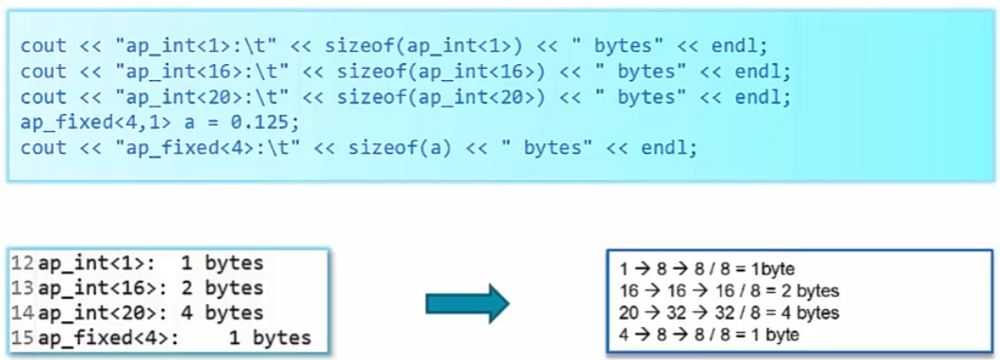
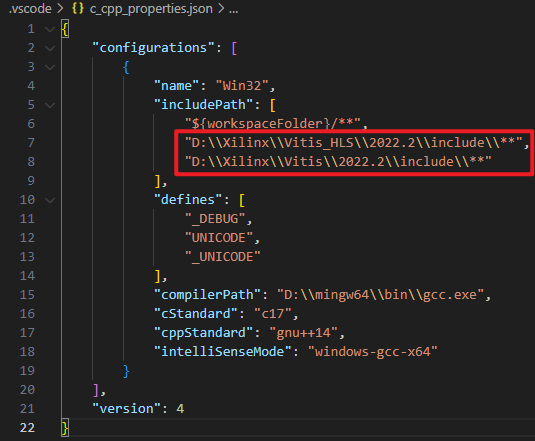
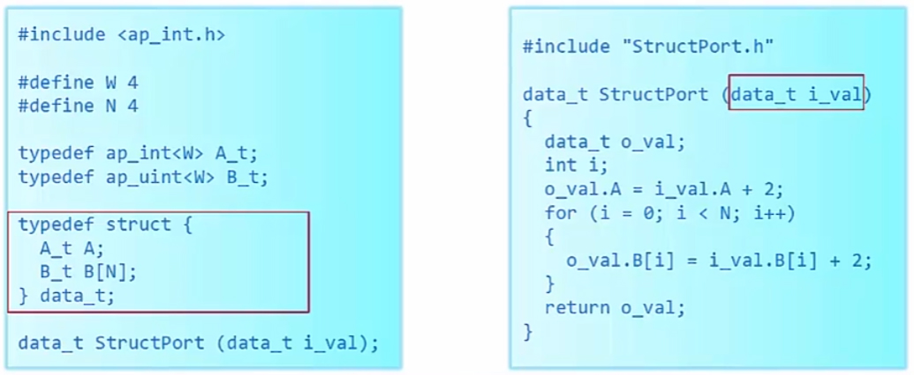
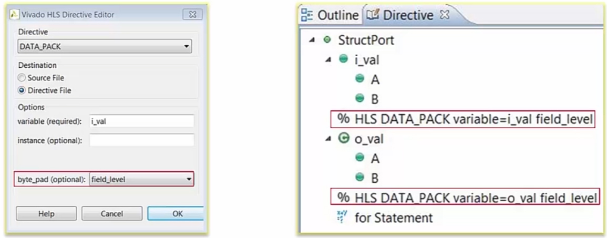
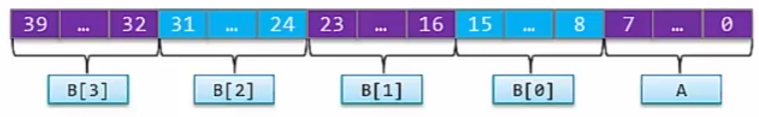
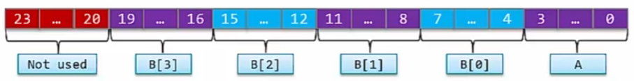
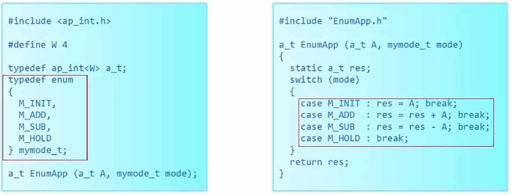

本笔记根据笔者目前的项目确定学习目标，目前主要集中在Vitis HLS上，使用的Vitis HLS版本为2022.2，在windows11下运行，仿真part为xcku15p_CIV-ffva1156-2LV-e，从这一篇开始是HLS的学习进度，主要根据教程：[跟Xilinx SAE 学HLS系列视频讲座-高亚军](https://www.bilibili.com/video/BV1bt41187RW)进行学习，并结合部分学习中查找的其他资料整理而成。
## 目录
* [1.Vitis HLS编程规范](#p1)
* [2.Vitis HLS数据类型](#p2)
* &nbsp;&nbsp;&nbsp;&nbsp;[2.1.任意精度数据](#p21)
* &nbsp;&nbsp;&nbsp;&nbsp;&nbsp;&nbsp;&nbsp;&nbsp;[2.1.1.任意精度数据结构及声明方式](#p211)
* &nbsp;&nbsp;&nbsp;&nbsp;&nbsp;&nbsp;&nbsp;&nbsp;[2.1.2.任意精度数据运算逻辑](#p212)
* &nbsp;&nbsp;&nbsp;&nbsp;[2.2.复合数据类型](#p22)
* &nbsp;&nbsp;&nbsp;&nbsp;&nbsp;&nbsp;&nbsp;&nbsp;[2.2.1.结构体](#p221)
* &nbsp;&nbsp;&nbsp;&nbsp;&nbsp;&nbsp;&nbsp;&nbsp;[2.2.2.枚举](#p222)
* [3.基本运算](#p3)


---
# 1.Vitis HLS编程规范<a id="p1"></a>
Vitis HLS（原Vivado HLS）是一个高级综合工具，即可以用C/C++高级语言也可以用verilog等硬件语言来实现硬件逻辑。

根据Vivado HLS的使用指南，需要对输入程序作出以下规范：
* **不使用动态内存分配（malloc, free, new, delete）**
* 减少使用指针对指针的操作
* **不使用系统调用（如abort, exit, printf）**，可以在测试平台上使用，但综合时这些指令会被无视
* 减少使用其他标准库里的内容（支持math.h中常用内容）
* 减少使用C++中的函数指针和虚拟函数
* **不使用递归方程**
* 精准表达交互接口

---

# 2.Vitis HLS数据类型<a id="p2"></a>
## 2.1.任意精度数据<a id="p21"></a>
在HLS编程中，主要用到的数据为任意精度数据，其中C语言和C++使用的头文件不同：

	C：ap_cint.h —— [u]int<W>  (1024 bits)
	C++：ap_int.h —— ap_[u]int<W>  (1024 bits，可扩展为32K位宽)
	C++：ap_fixed.h —— ap_[u]fixed<W,I,Q,O,N>

本文主要使用C++语言，使用的类型为ap_int\<W\>、ap_fixed\<W,I,Q,O,N\>及其无符号版本。

对于任意精度类型使用sizeof()时，其结果会对其到1、2、4等字节：

<div align="center"></div>

在例如VScode等IDE中显示类型或包含头文件报错时，可以在.vscode\c_cpp_properties.json中添加Vitis HLS的include目录：

	安装根目录\Vivado_HLS(Vitis_HLS)\版本号\include

<div align="center"></div>

---

## 2.1.1.任意精度数据结构及声明方式<a id="p211"></a>
**整型数据：**
ap_int\<W\>或ap_uint\<W\>作用为声明任意位数的整型数据（后者为无符号整型），W为数据位宽，主要声明方式为：

```cpp
ap_int<6> a_6bit_var = -22;
ap_int<6> a_6bit_var(-22);
ap_int<6> a_6bit_var(“0b101010”, 2);  // 通过第二个参数指定字符串表示的数字进制
ap_int<6> a_6bit_var(“101010”, 2);
ap_int<6> a_6bit_var(“-22”, 10);
```

**浮点数据**
更应该说是小数数据，因为它和浮点数由阶码、尾数组成不同，是由整数部分、小数部分组成，常用前四个参数：ap_fixed\<W,I,Q,O\>和ap_fixed\<W,I,Q,O\>

	W：数据总位宽
	I：整数部分位宽
	Q：量化模式（针对低位），默认为AP_TRN_ZERO（舍去低位），可指定为AP_RND（0舍1入）
	O：溢出模式（针对高位），默认为AP_WARP（舍去高位），可指定为AP_SAT（饱和，所有非符号位填充1）

主要声明方式为：

```cpp
ap_fixed<10,7> var = 10.5;  // 声明整数部分位宽为7，小数部分位宽为3（精度只能到0.125）
ap_fixed<3,2> var1 = 1.25; // 小数部分字长1，丧失精度=1
ap_fixed<3,2,AP_RND> var2 = 1.25; // AP_RND量化模式，0b01.01->0b01.1，0舍1入=1.5
ap_fixed<4,4> var3 = 19;  // 0b010011，取低四位0x0011=3
ap_fixed<4,4,AP_RND,AP_SAT> var4 = 19;  // 饱和溢出模式，填充为0x0111=7
```

---

## 2.1.2.任意精度数据运算逻辑<a id="p212"></a>
**运算目的**：“大数据不溢出，小数据不损失”

短数据+长数据，扩展短数据
有符号+无符号，扩展符号位
整型和浮点型相运算，结果为浮点型

	本文本框内“同类型”和“不同类型”指的是有/无符号类型，整型和浮点型运算可以参考int和float运算
	相加：
		同类型相加，结果位宽为最大位宽+1
		不同类型相加，如果无符号较大，则最大位宽+2，否则最大位宽+1
	相乘：
		同类型相乘，位宽相加
	相除：
		有符号相除，被除数位宽+1
		无符号相除，结果位宽为被除数位宽
	取模：
		同类型取模，结果位宽为最小位宽


**整型给整型赋值**：左值位宽n小于右值位宽m时，会在右值中取低n位赋值给左值，不仅可能发生溢出，并且左值为有符号数时，还可能改变整数符号。

**浮点型给浮点型赋值**：整数部分与整型类似，但通过配置AP_RND和AP_SAT，会得到不同的小数部分结果。

**整型和浮点型赋值**：均为整数部分赋值。


```cpp
ap_int<4> v1 = 3;
ap_uint<4> v2 = 3;
ap_int<2> res;
res = v1;  // 最终=-1，v1为0b0011，res赋值为0b11，数值位覆盖到符号位，出错
res = v2;  // 最终=-1，同上
ap_fixed<4,2> v3 = 1.25;
ap_fixed<3,2,AP_RND> v4 = v3;  // 最终=1.5，v3=0b01.01，v4赋值为0b01.1（AP_RND）

ap_uint<3> i1 = 4;
ap_uint<4> i2 = 10;
ap_ufixed<6,4> i3 = i2 / i1;  // 最终=2，和int类型一样，保留整数部分
ap_ufixed<6,4> i4 = (ap_ufixed<6,4>)i2 / i1;  // 最终=2.5,方式1，浮点与整形运算=浮点
ap_ufixed<6,4> i5 = ap_ufixed<6,4>(i2) / i1;  // 最终=2.5,方式2，浮点与整形运算=浮点
```

**获取数据类型信息**

```cpp
#include <typeinfo>
typeid(var).name()
```

**hls的math库**
虽然HLS中无法使用标准库，但hls_math.h库支持了C的math.h和C++的cmath.h，包括数据类型和方法。

## 2.2.复合数据类型<a id="p22"></a>
Vitis HLS中支持结构体和枚举类型。

### 2.2.1.结构体<a id="p221"></a>

Vitis HLS中和C/C++一样，可以声明结构体类型，并且可以使用任意精度类型声明成员：

<div align="center"></div>

对于实例化的结构体对象，可以使用DATA_PACK约束（directive）来指定结构体内部数据结构

<div align="center"></div>


field_level会将结构体所有成员位宽分别对齐到1字节，然后在内存中依次放置：

<div align="center"></div>


struct_level则会保留每个成员的实际位宽，在内存中紧靠着放，最后向上对其1字节，如下图中，各个成员的位宽相加为19，因此对其到3字节：
<div align="center"></div>

---
### 2.2.2.枚举<a id="p222"></a>
枚举类型占用位宽会自动分配，如下图mymode_t共4个枚举数据，因此位宽为2，其余和C/C++的枚举相同，不再赘述。

<div align="center"></div>

---
# 3.基本运算<a id="p3"></a>
	算术运算 + - * / %  大数据不溢出，小数据不损失
	算术赋值 = += -= *= /= %=
	自增自减 ++ --
	条件  ?:
	关系运算  >  <  >=  <=  ==  !=
	逻辑 ! && ||
	位运算 <<  >>  ~  &  |  ^

常数参与具体运算时，最好告知具体数据类型：

```cpp
sum = din + din_t(0.25);
```
