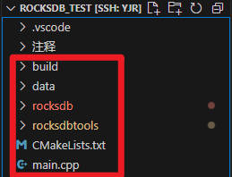
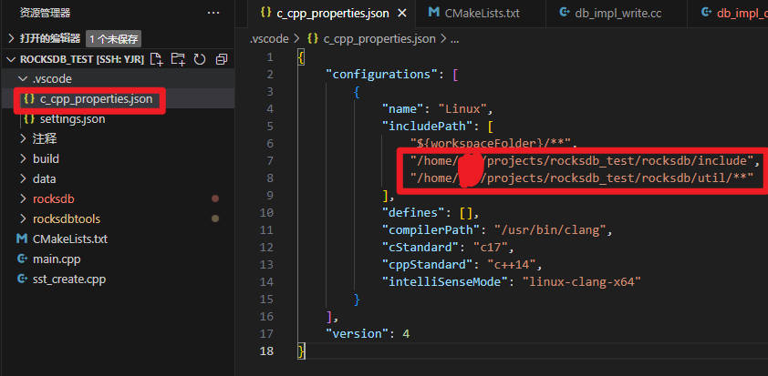
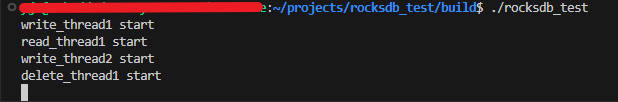
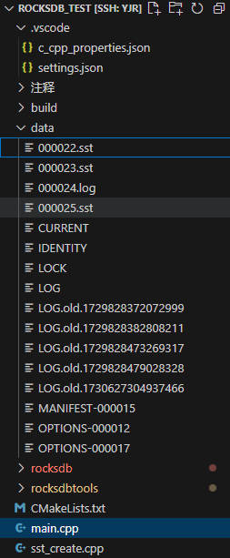
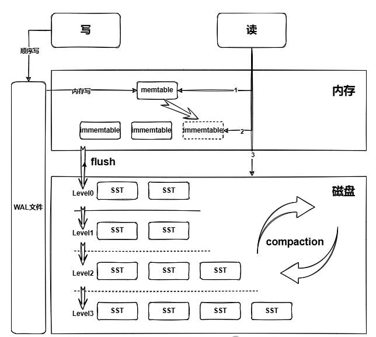
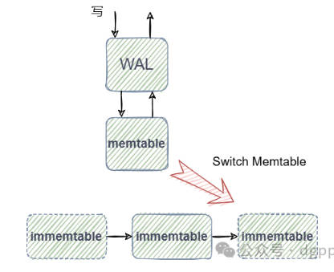
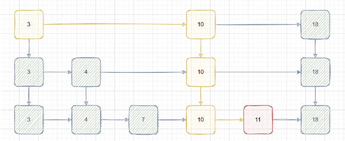
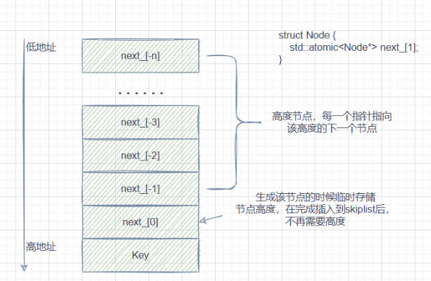
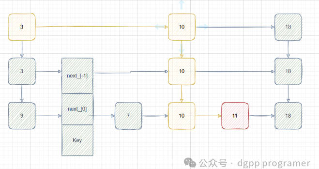

算是打算正式开始学习分布式存储了，打算以深研RocksDB为主，因为目前研究涉及rocksdb和FPGA，所以先尽快熟悉这两部分，之后从ceph开始打牢分布式基础。

与我目前大部分文章相同的是，我还在速成阶段，学习基本是找到一个主教程然后看完，当前笔记学习的大佬是dgpp_programer，主要是他的[写性能最强的kv数据库RocksDB全集详解](https://www.bilibili.com/video/BV1vDWseEEys/?spm_id_from=333.999.0.0)系列，他的b站主页：[https://space.bilibili.com/207333980](https://space.bilibili.com/207333980)，微信公众号：dgpp programer

本文章同步到我的笔记：[https://github.com/HentaiYang/NoteBooks](https://github.com/HentaiYang/NoteBooks)
## 目录
* [一、RocksDB介绍](#p1)
* [二、RocksDB的获取和简单使用](#p2)
* [三、RocksDB执行流程](#p3)
* [四、WAL](#p4)
* [五、MANIFEST](#p5)
* [六、MemTable](#p6)
* [七、SkipList](#p7)

---
# 一、RocksDB介绍<a id="p1"></a>
Rocksdb 是基于Google LevelDB研发的高性能kv持久化存储引擎，以库组件形式嵌入程序中，为大规模分布式应用在ssd上运行提供优化。RocksDB不提供高层级的操作，例如备份、负载均衡、快照等，而是选择提供工具支持将实现交给上层应用。正是这种高度可定制化能力，允许RocksDB对广泛的需求和工作负载场景进行定制。（随便搬来的，想着至少应该有个简单介绍）

---
# 二、RocksDB的获取和简单使用<a id="p2"></a>

想了半天发现还是先把rocksdb跑起来是最好的，那么首先是rocksdb的获取方式：

**获取RocksDB：**
	
	git clone https://github.com/facebook/rocksdb.git
	git checkout v9.0.0  # 设定想用的版本，项目有要求时可以设置

clone完成后，可以将Makefile中**WARNING_FLAGS += -Werror**一行注释掉，否则有WARNING就可能编译不出来。

**编译方式**：
一般用动态库，如何编写和使用一等会给出：

	动态库编译：
	make shared_lib
	make install-shared PREFIX=/usr/local/rocksdb
	
	静态库编译：
	make static_lib
	make install-static PREFIX=/usr/local/rocksdb
	
	将rocksdb作为子项目编译：
	添加编译目标
	add_custom_target(build_rocksdb
	COMMAD make -j4 shared_lib -C ${ROCKSDB_SOURCE_DIR}
	COMMENT “Building RocksDB”
	}
	
	添加依赖
	ADD_DEPENDENCIES(main_target build_rocksdb)

	编译单元测试
	如db_iter_test.cc：make db_iter_test -j4

创建一个项目目录，创建build、data目录，clone一个rocksdb后拷贝为一个新的rocksdbtools目录，用来编译分析工具，创建CMakeLists.txt文件和main.cpp文件。创建指令：

```bash
make rocksdb_test
cd rocksdb_test
mkdir build data
touch CMakeLists.txt main.cpp
git clone https://github.com/facebook/rocksdb.git
# cd rocksdb  # 如果需要配置版本就加上这三个命令
# git checkout v9.0.0
# cd ..

cp rocksdb rocksdbtools
```

<div align="center">  </div>

vscode记得配置c_cpp_properties.json，在includePath中添加rocksdb的include目录，这样就可以ctrl+左键快速切换了，如果没有该文件可自行创建或ctrl+shift+p找到c/c++编辑配置来生成这个文件

<div align="center">  </div>

```C
{
    "configurations": [
        {
            "name": "Linux",
            "includePath": [
                "${workspaceFolder}/**",
                "/home/username/projects/rocksdb_test/rocksdb/include",
                "/home/username/projects/rocksdb_test/rocksdb/util/**"
            ],
            "defines": [],
            "compilerPath": "/usr/bin/clang",
            "cStandard": "c17",
            "cppStandard": "c++14",
            "intelliSenseMode": "linux-clang-x64"
        }
    ],
    "version": 4
}
```
---
### 编写文件
**CMakeLists.txt**写入内容：

```c
CMAKE_MINIMUM_REQUIRED(VERSION 3.0.0)

PROJECT(rocksdb_test VERSION 0.1.0)
# 设置环境变量
SET(CMAKE_BUILD_TYPE "Debug")
SET(CMAKE_CXX_STANDARD 17)
SET(ROCKSDB_DIR "/home/username/projects/rocksdb_test/rocksdb") # 修改为rocksdb路径
# 打印信息
MESSAGE(STATUS "PROJECT_BINARY_DIR = " ${PROJECT_BINARY_DIR})
MESSAGE(STATUS "PROJECT_SOURCE_DIR = " ${PROJECT_SOURCE_DIR})
MESSAGE(STATUS "CMAKE_SOURCE_DIR = " ${CMAKE_SOURCE_DIR})
MESSAGE(STATUS "ROCKSDB_DIR = " ${ROCKSDB_DIR})
# 包含目录
INCLUDE_DIRECTORIES(${ROCKSDB_DIR}/include)
INCLUDE_DIRECTORIES("/usr/local/include")
# 添加依赖，这里添加的是动态库依赖，先编译完rocksdb后，再编译main.cpp
add_custom_target(BUILD_ROCKSDB
    COMMAND make -j4 shared_lib -C ${ROCKSDB_DIR}
    COMMENT "Building Rocksdb"
)
# 添加Makefile的target的依赖
ADD_EXECUTABLE(rocksdb_test main.cpp)
ADD_DEPENDENCIES(rocksdb_test BUILD_ROCKSDB)
# 这里我main.cpp用来测试，sst_create.cpp是项目用到的创建sst文件的程序
# 这样想编译哪个.cpp就添加一个，很方便
ADD_EXECUTABLE(sst_create sst_create.cpp)
ADD_DEPENDENCIES(sst_create BUILD_ROCKSDB)
# 添加项目依赖库
FIND_LIBRARY(LIB_GFLAGS gflags)
FIND_LIBRARY(LIB_DL dl)
FIND_LIBRARY(LIB_TCMALLOC tcmalloc)
SET(LIBRARY_DIR
    ${LIB_TCMALLOC}
    ${LIB_DL}
    ${LIB_CFLAGS}
)
# 添加target，添加几个，make时就执行几个，通过make rocksdb_test可以单独编译某一个目标
TARGET_LINK_LIBRARIES(rocksdb_test PRIVATE ${ROCKSDB_DIR}/librocksdb.so ${LIBRARY_DIR} pthread)
TARGET_LINK_LIBRARIES(sst_create PRIVATE ${ROCKSDB_DIR}/librocksdb.so ${LIBRARY_DIR} pthread)
```

**main.cpp**文件内容，其中运行了2个写线程，1个读线程，1个删除线程，每次操作的key都是随机生成的，所以读和删除可能有执行不成功（不是错误）的情况，可以自行在对应位置打印查看：

```cpp
#include <rocksdb/db.h>
#include <rocksdb/options.h>
#include <iostream>
#include <string>
#include <vector>
#include <time.h>
#include <thread>
#include <cstdint>
#include <chrono>
#include <stdlib.h>
#include <random>

using namespace std;

void test01() {
    rocksdb::DB* db;
    rocksdb::Options options;
    options.create_if_missing = true;
    options.max_bytes_for_level_base = 32 * 1024 *1024;
    options.max_bytes_for_level_multiplier = 10;
    options.target_file_size_base = 16 * 1024 * 1024;
    options.max_write_buffer_number = 4;
    
    rocksdb::Status status = rocksdb::DB::Open(options, "../data/", &db);
    if (!status.ok()) {
        cout << "Open Error : " << status.ToString() << endl;
        return ;
    }
    this_thread::sleep_for(std::chrono::seconds(1));
    std::random_device rd;
    std::mt19937 gen(rd());
    std::uniform_int_distribution<int> dis(0, 100000000);

    std::thread write_thread1([&](){
        rocksdb::Status s;
        rocksdb::WriteOptions writeOptions;
        cout << "write_thread1 start"  << endl;
        int i = 0;
        while (true) {
            int random_number = dis(gen);
            string key = "key" + to_string(random_number);
            string value = "value" + to_string(random_number);
            s = db->Put(writeOptions, key, value);
            ++i;
            if (!s.ok()) {
                cout << "[write_thread1] Error : "<<  i <<" "<< s.ToString() << key << " " << value << endl;
                return ;
            }
        }
    });

    std::thread write_thread2([&](){
        rocksdb::Status s;
        rocksdb::WriteOptions writeOptions;
        cout << "write_thread2 start"  << endl;
        while (true) {
            int random_number = dis(gen);
            string key = "key" + to_string(random_number);
            string value = "value" + to_string(random_number);
            s = db->Put(writeOptions, key, value);
            if (!s.ok()) {
                cout << "[write_thread2] Error : " << s.ToString() << key << " " << value << endl;
                return ;
            }
        }
    });

    std::thread read_thread1([&](){
        rocksdb::Status s;
        rocksdb::ReadOptions read_options;
        cout << "read_thread1 start"  << endl;
        while (true) {
            int random_number = dis(gen);
            string key = "key" + to_string(random_number);
            string value;
            s = db->Get(read_options, key, &value);
            if (!s.ok()) {
                //cout << "[read_thread1] Error : " << s.ToString() << key << " " << value << endl;
                //return ;
            }
        }
    });

    std::thread delete_thread1([&](){
        rocksdb::Status s;
        rocksdb::WriteOptions writeOptions;
        cout << "delete_thread1 start"  << endl;
        while (true) {
            int random_number = dis(gen);
            string key = "key" + to_string(random_number);
            s = db->Delete(writeOptions, key);
            if (!s.ok()) {
                cout << "[delete_thread1] Error : " << s.ToString() << key << endl;
                return ;
            }
        }
    });

    write_thread1.join();
    write_thread2.join();
    read_thread1.join();
    delete_thread1.join();
    delete db;
    return ;
}


int main() {
    test01();

    return 0;
}
```

编译和执行流程，记得系统中要安装cmake和make：

```bash
cd build
cmake ..
make
./rocksdb_test
```

执行后命令行会出现如下打印：

<div align="center">  </div>

data目录中会出现如下数据，记得执行一段时间后ctrl+c停止程序运行，避免之后分析时文件过大速度变慢

	data/LOG：rocksdb运行日志
		先打印配置（Options）
		DB Stats：db状态
		Compaction Stats：LSM树状态
	data/OPTIONS-xxxxxx：最近打开的一次配置

<div align="center">  </div>

这样就完成了rocksdb的基本使用、编译和执行，接下来会对rocksdb的执行流程、基本概念和刚刚生成的文件进行分析。

---
# 三、RocksDB执行流程<a id="p3"></a>

**RocksDB的执行流程如下：**

**写入：** 先写入WAL（预写日志），然后写入memtable，当memtable被写满（或超过阈值）时，就固化为immemtable，等待落盘（Flush操作），一个后台线程会定期将所有immemtable通过Flush操作落盘到存储介质上（如ssd）为sst文件。

**读取：** 先到memtable中查询，然后到immemtable中查询，最后到磁盘查找各个sst（L0查找所有文件，L1及以上通过二分查找），其中可能会查询一些内存中的缓存（Cache）文件，只要查询到就返回。

sst文件的存放结构为LSM Tree，请自行查询概念，因为L0允许Key重叠，所以读取时要查询所有sst文件，从L1往上开始，不同sst之间key范围不重叠，所以可以进行二分查找。

<div align="center">  </div>

---
# 四、WAL<a id="p4"></a>
Write Ahead Log，数据写入前会先写入到log中，提供数据持久性和故障恢复能力，其具备如下优点：
* 持久性：系统崩溃或断电时，未落盘数据不会丢失
* 快速恢复：系统重启时，通过重放WAL中操作，将系统还原到最后一次正常关闭的状态
* 性能优化：相比于落盘，写入log通常更快，因为落盘可以延迟执行，写入日志文件可以立即完成

**WAL分析工具：ldb**

编译方式：

	进入rocksdbtools根目录，这个目录专门用来编译分析工具
	cd rocksdbtools
	make ldb  //默认debug版本
	DEBUG_LEVEL=0 make ldb  //release版本
	
最好是单独clone一个目录（如rocksdbtools）用来编译各个分析工具，如果你的测试程序同时也使用同一个rocksdb目录时，可能会出现编译错误。

如果出现编译错误：make clean后再次编译

使用方式：

	./ldb dump_wal --walfile=../data/000024.log --header --print_value

WAL的结构：从左到右为序列号，操作个数，字节数，物理偏移，PUT(0)表示写入，0代表列族id为0（默认列族）

```bash
Sequence,Count,ByteSize,Physical Offset,Key(s) : value 
1409182,3,79,0,DELETE(0) : 0x6B65793234343731393331 PUT(0) : 0x6B65793533353939363434 : 0x76616C75653533353939363434 PUT(0) : 0x6B65793232363230363439 : 0x76616C75653232363230363439 
1409185,2,66,86,PUT(0) : 0x6B65793732313734373132 : 0x76616C75653732313734373132 PUT(0) : 0x6B65793432383836373732 : 0x76616C75653432383836373732 
1409187,1,25,159,DELETE(0) : 0x6B65793130393032313930 
1409188,2,66,191,PUT(0) : 0x6B65793638353537303639 : 0x76616C75653638353537303639 PUT(0) : 0x6B65793137363332353834 : 0x76616C75653137363332353834 
1409190,1,25,264,DELETE(0) : 0x6B65793631303430343132 
```

---
# 五、MANIFEST<a id="p5"></a>
描述所有列族中LSM树结构信息的文件，包括每层sst文件数量，每层文件概要信息，用于重建树

文件分析方式：

	./ldb manifest_dump --path="../data/MANIFEST-000015"

默认列族为0，分析结果的结构：

```bash
Log number：日志文件编号
Comparator：比较器，用于比较key之间大小
BytewiseComparator：根据字符大小比较key
--------------- Column family "default"  (ID 0) --------------
log number: 8
comparator: leveldb.BytewiseComparator
--- level 0 --- version# 1 ---
 9:19946862[1 .. 1409181]['key10000069' seq:1231705, type:1 .. 'key99999983' seq:1116682, type:1]
// 9对应sst编号，大小为19946862字节，最小seq为0，最大seq为1409181
// type为写入类型，参考枚举类型ValueType
--- level 1 --- version# 1 ---
--- level 2 --- version# 1 ---
...省略
--- level 63 --- version# 1 ---
next_file_number 11 last_sequence 1409181  prev_log_number 0 max_column_family 0 min_log_number_to_keep 8

Next_file_number：下一个sst可用编号
Last_sequence：上次写操作序列号
Prev_log_number：之前的log（WAL）文件编号
Max_column_family：最大的列族编号
Min_log_number_to_keep：2PC模式下使用，恢复中忽略小于等于该值的日志
```

---
# 六、Memtable<a id="p6"></a>
写入过程：先写WAL，再写memtable，memtable满或满足一定条件之后变为immemtable待刷新（flush），生成一个新的memtable。
数据写入memtable视为写入成功，memtable存放在内存中，同时服务于读和写，新的写入总是插入到memtable，一个memtable被写满或满足一定条件后，会变成不可修改的immemtable，并被一个新的memtable替换，一个后台线程会将immemtable落盘（flush）到一个sst文件，之后该immemtable会被销毁。

<div align="center">  </div>

MemTable源码：

```cpp
class MemTable {
  ...
  KeyComparator comparator_;	// 用于比较key的大小
  ...
  std::unique_ptr<MemTableRep> table_;	// 指向skiplist
  std::unique_ptr<MemTableRep> range_del_table_;	// 指向特殊的skiplist，用于kTypeRangeDeletion类型，如连续删除key1-key5时，仅需指定一次key(1-5)，节省资源
  std::atomic_bool is_range_del_table_empty_;

  // Total data size of all data inserted
  std::atomic<uint64_t> data_size_;	// 总数据大小
  std::atomic<uint64_t> num_entries_;	// 元素个数
  std::atomic<uint64_t> num_deletes_;	// 删除个数
  std::atomic<uint64_t> num_range_deletes_;	// 批量删除个数

  // Dynamically changeable memtable option
  std::atomic<size_t> write_buffer_size_;	// memtable支持的最大大小

  // These are used to manage memtable flushes to storage
  bool flush_in_progress_;  // started the flush，是否在flush中
  bool flush_completed_;    // finished the flush，flush是否完成
  uint64_t file_number_;    // filled up after flush is complete

  // The updates to be applied to the transaction log when this
  // memtable is flushed to storage.
  VersionEdit edit_;	// 从属的版本
  std::unique_ptr<DynamicBloom> bloom_filter_;	// 布隆过滤器，快速判断key是否在memtable中
}
```

Memtable插入一条kv的数据格式：

	|-internal_key_size-|---key---|--seq--|--type--|--value_size--|---value---|
	Internal_key_size：varint类型，包括key、seq、type所占的字节数
	Key：字符串，写入的key
	Seq：序列号，占7个字节
	Type：操作类型，占1个字节
	Value_size：var_int类型，表示value长度
	Value：字符串，写入的value

---
# 七、Skiplist<a id="p7"></a>
Memtable最常用的实现基于skiplist（跳表），在多数情况下读、写、随机访问及序列化扫描性能较好，且支持并发写入。跳表基础不属于本笔记记录内容，请自行查阅。

<div align="center">  </div>

```cpp
struct Node{
	std::atomic<Node*> next_[1];
}
```

生成节点时，会根据一个随机生成的高度h（保证跳表插入的平衡）创建h个节点+1个Key的空间，其中next_[0]首先临时存储节点高度（最高层节点插入时得先找到对应层，在这里存了就不用额外传一个参数），最终将Key插入到skiplist后就不再需要存储高度了。

插入过程：最高节点开始，循环：同高度有下一节点且小于等于key则跳转该节点，否则高度-1。

<div align="center">  </div>

Key插入到跳表中之后如下图所示：

<div align="center">  </div>

源码：

```cpp
Status MemTable::Add(SequenceNumber s, ValueType type,
                     const Slice& key, /* user key */
                     const Slice& value,
                     const ProtectionInfoKVOS64* kv_prot_info,
                     bool allow_concurrent,
                     MemTablePostProcessInfo* post_process_info, void** hint) {
  // kv编码
// Format of an entry is concatenation of:
  //  key_size     : varint32 of internal_key.size()
  //  key bytes    : char[internal_key.size()]
  //  value_size   : varint32 of value.size()
  //  value bytes  : char[value.size()]
  //  checksum     : char[moptions_.protection_bytes_per_key]
  uint32_t key_size = static_cast<uint32_t>(key.size());
  uint32_t val_size = static_cast<uint32_t>(value.size());
  uint32_t internal_key_size = key_size + 8;  // 对应seq7+type1字节
  const uint32_t encoded_len = VarintLength(internal_key_size) +
                               internal_key_size + VarintLength(val_size) +
                               val_size + moptions_.protection_bytes_per_key;
  char* buf = nullptr;
  std::unique_ptr<MemTableRep>& table =  // 申请skiplist
      type == kTypeRangeDeletion ? range_del_table_ : table_;
  KeyHandle handle = table->Allocate(encoded_len, &buf);

  char* p = EncodeVarint32(buf, internal_key_size);
  memcpy(p, key.data(), key_size);
  Slice key_slice(p, key_size);
  p += key_size;
  uint64_t packed = PackSequenceAndType(s, type);  // seq和type打包为8字节
  EncodeFixed64(p, packed);
  p += 8;
  p = EncodeVarint32(p, val_size);
  memcpy(p, value.data(), val_size);
  assert((unsigned)(p + val_size - buf + moptions_.protection_bytes_per_key) ==
         (unsigned)encoded_len);

  UpdateEntryChecksum(kv_prot_info, key, value, type, s,
                      buf + encoded_len - moptions_.protection_bytes_per_key);
  Slice encoded(buf, encoded_len - moptions_.protection_bytes_per_key);
if (kv_prot_info != nullptr) {
    TEST_SYNC_POINT_CALLBACK("MemTable::Add:Encoded", &encoded);
    Status status = VerifyEncodedEntry(encoded, *kv_prot_info);
    if (!status.ok()) {
      return status;
    }
  }
  Slice key_without_ts = StripTimestampFromUserKey(key, ts_sz_);
  // allow_concurrent默认为false
  if (!allow_concurrent) {
// Extract prefix for insert with hint.
    if (insert_with_hint_prefix_extractor_ != nullptr &&
        insert_with_hint_prefix_extractor_->InDomain(key_slice)) {
      Slice prefix = insert_with_hint_prefix_extractor_->Transform(key_slice);
  // 带hint插入，通过map记录一些前缀插入skiplist的位置，从而快速插入同样的前缀
  // 默认不启用
      bool res = table->InsertKeyWithHint(handle, &insert_hints_[prefix]);
      if (UNLIKELY(!res)) {
        return Status::TryAgain("key+seq exists");
      }
} else {
  // 插入到skiplist
      bool res = table->InsertKey(handle);
      if (UNLIKELY(!res)) {
        return Status::TryAgain("key+seq exists");
      }
}

// 更新统计信息
// this is a bit ugly, but is the way to avoid locked instructions
    // when incrementing an atomic
    num_entries_.store(num_entries_.load(std::memory_order_relaxed) + 1,
                       std::memory_order_relaxed);
    data_size_.store(data_size_.load(std::memory_order_relaxed) + encoded_len,
                     std::memory_order_relaxed);
    if (type == kTypeDeletion || type == kTypeSingleDeletion ||
        type == kTypeDeletionWithTimestamp) {
      num_deletes_.store(num_deletes_.load(std::memory_order_relaxed) + 1,
                         std::memory_order_relaxed);
    } else if (type == kTypeRangeDeletion) {
      uint64_t val = num_range_deletes_.load(std::memory_order_relaxed) + 1;
      num_range_deletes_.store(val, std::memory_order_relaxed);
    }
    // 更新布隆过滤器
    if (bloom_filter_ && prefix_extractor_ &&
        prefix_extractor_->InDomain(key_without_ts)) {
      bloom_filter_->Add(prefix_extractor_->Transform(key_without_ts));
    }
    if (bloom_filter_ && moptions_.memtable_whole_key_filtering) {
      bloom_filter_->Add(key_without_ts);
}

    // The first sequence number inserted into the memtable
    assert(first_seqno_ == 0 || s >= first_seqno_);
    if (first_seqno_ == 0) {
      first_seqno_.store(s, std::memory_order_relaxed);

      if (earliest_seqno_ == kMaxSequenceNumber) {
        earliest_seqno_.store(GetFirstSequenceNumber(),
                              std::memory_order_relaxed);
      }
      assert(first_seqno_.load() >= earliest_seqno_.load());
    }
    assert(post_process_info == nullptr);
    // TODO(yuzhangyu): support updating newest UDT for when `allow_concurrent`
    // is true.
    MaybeUpdateNewestUDT(key_slice);
    UpdateFlushState();
  } else {
// 并发插入
// ...
  }
  // 处理范围删除操作
  // ...
  UpdateOldestKeyTime();

  TEST_SYNC_POINT_CALLBACK("MemTable::Add:BeforeReturn:Encoded", &encoded);
  return Status::OK();
}
```

链表申请内存：

```cpp
char* InlineSkipList<Comparator>::AllocateKey(size_t key_size) {
  // 随机一个节点里的高度
  return const_cast<char*>(AllocateNode(key_size, RandomHeight())->Key());
}
```

申请节点空间：

```cpp
InlineSkipList<Comparator>::AllocateNode(size_t key_size, int height) {
  // 高度-1个Node指针，每个指针指向该高度的下一个节点(next_[-n]~next_[-1])
  auto prefix = sizeof(std::atomic<Node*>) * (height - 1);

  // 最终通过AllocateAligned申请内存，申请height个节点+key的空间
  char* raw = allocator_->AllocateAligned(prefix + sizeof(Node) + key_size);
  // x为高度0的位置，数据从低地址到高地址存放，所以放在raw+prefix
  Node* x = reinterpret_cast<Node*>(raw + prefix);

  // next_[0]用于暂时存储节点高度（指定next_[-n]时使用）
  // 插入完成后就知道下一个节点地址了，会存储到next_[0]，不需要继续存节点高度
  x->StashHeight(height);
  return x;  // 返回最高地址，用于[-i]的取用（充分利用cpu的prefetch）
}
```

相较leveldb的优化：

	低地址存放高节点，高地址存放低节点，充分利用CPU的prefetch
	Key存放完整数据，而不是指针

