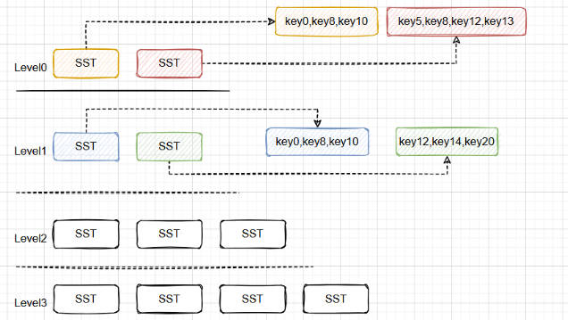
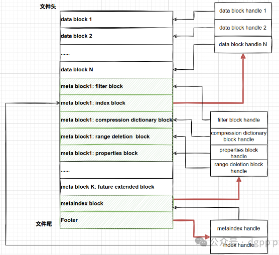
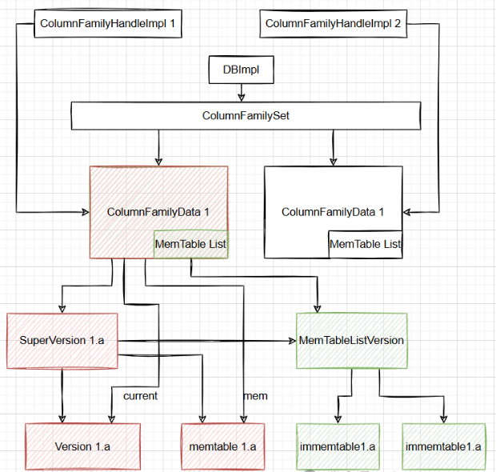
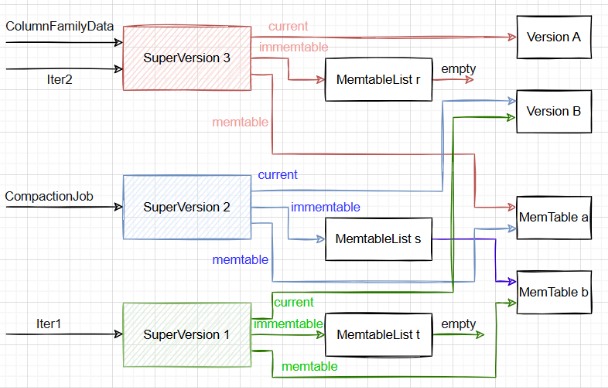
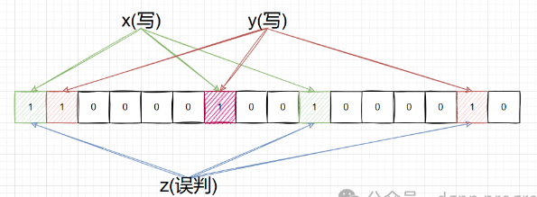

当前笔记参考的作者是dgpp_programer，主要是他的[写性能最强的kv数据库RocksDB全集详解](https://www.bilibili.com/video/BV1vDWseEEys/?spm_id_from=333.999.0.0)系列

本文章同步到我的笔记：[https://github.com/HentaiYang/NoteBooks](https://github.com/HentaiYang/NoteBooks)

---

**学习笔记：《RocksDB学习笔记》索引**
[RocksDB学习笔记#1 基本概念和简单使用](https://blog.csdn.net/qq_38876396/article/details/143467285)
[RocksDB学习笔记#2 SST、列族、Version、布隆过滤器](https://blog.csdn.net/qq_38876396/article/details/143469050)
[RocksDB学习笔记#3 写流程](https://blog.csdn.net/qq_38876396/article/details/143469414)
[RocksDB学习笔记#4 读流程](https://blog.csdn.net/qq_38876396/article/details/143469892)
[RocksDB学习笔记#5 Flush流程](https://blog.csdn.net/qq_38876396/article/details/143470573)
[RocksDB学习笔记#6 Compaction流程(1) —— 触发流程](https://blog.csdn.net/qq_38876396/article/details/143475637)
[RocksDB学习笔记#7 Compaction流程(2) —— 执行流程](https://blog.csdn.net/qq_38876396/article/details/143478199)

---

## 目录
* [1.SST](#p1)
* [2.列族](#p2)
* [3.Version](#p3)
* [4.Bloom Filter](#p4)

---

# 1.SST<a id="p1"></a>

SST（Sorted String Table），通过flush和compaction生成，SST内Key是
有序的，Key和Value都是任意长度的字符串。L0的各个SST的Key范围可以重叠，L1及以上的SST之间是严格有序的，下一个SST的最小Key必定大于上一个SST的最大Key。因为Flush操作不会做合并，所以L0的SST之间不会保持有序。

<div align="center">  </div>


SST结构：

	Footer：
		Footer存储index block、metaindex block的位置和大小
		Index block存储所有data block的位置和大小
		Metaindex block存储除index block外所有meta block的位置和大小
	Filter block：过滤器元数据块，快速确定key是否在sst中（一定不存在，或低误判率可能存在）
	Compression dictionary block：压缩字典元数据块
	Properties block：属性元数据块
	Range deletion block：范围删除元数据块，可以快速确定key是否被删除
	
<div align="center">  </div>

**sst分析工具：sst_dump**

编译方式：

```bash
cd rocksdbtools
make sst_dump
```

使用方式：

```bash
./sst_dump --file=../data/000012.sst --command=raw
```

运行后会在sst同级目录生成000012_dump.txt，其内部结构：

```C
Footer Details:
--------------------------------------
  metaindex handle: DB928B0123
  index handle: D99E8A01F86C
  table_magic_number: 9863518390377041911		//魔术值，固定
  format version: 5		// 版本
  
Metaindex Details:
--------------------------------------
  Properties block handle: D68B8B018007

Table Properties:
--------------------------------------
  # data blocks: 891	// datablock个数
  # entries: 153074	// 写入次数，也就是kv对个数，包括PUT，删除和范围删除
  # deletions: 51033	// 删除次数，包括范围删除
  # merge operands: 0	// merge个数
  # range deletions: 0	// 范围删除次数
  raw key size: 2891335		// Key总大小
  raw average key size: 18.888479	// 平均Key大小
  raw value size: 1315125	// value总大小
  raw average value size: 8.591433	// 平均Value大小
  data block size: 2264921	// data block大小
  index block size (user-key? 1, delta-value? 1): 17531		// index block大小
  filter block size: 0	// filter block大小
  # entries for filter: 0	// filter接收到的请求个数？
  (estimated) table size: 2282452		// 预估table大小
  filter policy name: N/A	// filter名称
  prefix extractor name: nullptr	// 前缀提取器名称
  column family ID: 0	// 列族ID
  column family name: default	// 列族名称
  comparator name: leveldb.BytewiseComparator	// 比较器名称
  user defined timestamps persisted: true	// 用户是否定义时间戳保持不变
  merge operator name: nullptr		// 合并操作符名称
  property collectors names: []		// 属性收集器名称
  SST file compression algo: Snappy	// SST压缩方法为Snappy
  SST file compression options: window_bits=-14; level=32767; strategy=0; max_dict_bytes=0; zstd_max_train_bytes=0; enabled=0; max_dict_buffer_bytes=0; use_zstd_dict_trainer=1; 	// SST压缩配置
  creation time: 1729415545		// 最先写入memtable的时间
  time stamp of earliest key: 0	// 最早写入的key的时间戳
  file creation time: 0		// sst文件创建的时间
  slow compression estimated data size: 0
  fast compression estimated data size: 0
  DB identity: c50e5b37-63eb-4bd3-981a-c90e97dc79fd
  DB session identity: QUDZI0KVIC4XED7IZDQL
  DB host id: embedded415-System-Product-Name
  original file number: 12
  unique ID: 382E354BFA955664-8374E402ADC38AA9
  Sequence number to time mapping: 

Index Details:  // 索引data block
--------------------------------------
  Block key hex dump: Data block handle
  Block key ascii

  HEX    6B65793130313136: 00E813 offset 0 size 2536
  ASCII  k e y 1 0 1 1 6 
  ------
  HEX    6B65793130323035: ED13E013 offset 2541 size 2528
  ASCII  k e y 1 0 2 0 5 
  ------

Range deletions:  // 范围删除数据（样例）
--------------------------------------
  HEX    6B65793130323035: ED13E013 offset 2541 size 2528
  ASCII  k e y 1 0 1 1 6 : k e y 1 0 2 0 5
  ------

Data Block # 1 @ 00E813  // data block存储数据
--------------------------------------
  HEX    6B65793130303030313630: 76616C75653130303030313630
  ASCII  k e y 1 0 0 0 0 1 6 0 : v a l u e 1 0 0 0 0 1 6 0 
  ------
  HEX    6B65793130303031343038: 76616C75653130303031343038
  ASCII  k e y 1 0 0 0 1 4 0 8 : v a l u e 1 0 0 0 1 4 0 8 
  ------


Data Block Summary:	// data block 概要（在最后）
--------------------------------------
  # data blocks: 891
  min data block size: 2082
  max data block size: 2622
  avg data block size: 2536.998878
```

---
# 2.列族<a id="p2"></a>
将数据库的数据进行逻辑划分，弥补了rocksdb单个进程只能操作一个数据库的问题，每个列族有自己的LSM结构，共享WAL，不共享memtable、immemtable、SST。默认只有一个列族，名称default。类似数据库“表”的概念。

配置分为ColumnFamilyOptions和DBOptions，前者是单个列族的配置，后者是整个DB的配置。

通过DBImpl获取ColumnFamilySet，该结构存储列族对应数据（使用ColumnFamilyHandleImpl句柄也能获取数据）。

	Version：管理版本的所有sst文件
	SuperVersion：存储Verion、Memtable和MemtableListVersion，比起Version多管理了内存中的数据

<div align="center">  </div>


源码：

```cpp
class DBImpl : public DB {
  // 根据列族ID获取ColumnFamilyData
  ColumnFamilyHandle* GetColumnFamilyHandle(uint32_t column_family_id);
  // 可以用于获取ColumnFamilySet
  std::unique_ptr<ColumnFamilyMemTablesImpl> column_family_memtables_;
  std::unique_ptr<VersionSet> versions_;
}

class ColumnFamilyMemTablesImpl : public ColumnFamilyMemTables {
  ColumnFamilySet* column_family_set_;
}

class VersionSet {
  std::unique_ptr<ColumnFamilySet> column_family_set_;
}

class ColumnFamilySet {
  // 列族ID到列族数据的映射
  UnorderedMap<uint32_t, ColumnFamilyData*> column_family_data_;
}

class ColumnFamilyData {
  MemTable* mem_;	// 当前的Memtable
  MemTableList imm_;	// 管理immemtable
  SuperVersion* super_version_;	// super_version，维护该列族最新版本的memtable、immemtable、sst
}

class MemTableList {
  MemTableListVersion* current_;	// 管理多个immemtable
}

class MemTableListVersion {
  std::list<MemTable*> memlist_;	// 等待flush的immemtable
}
```

---
# 3.Version管理<a id="p3"></a>
管理某一个时刻的db状态，任何读写都是对一个version的操作。

当compaction结束或immemtable被flush到磁盘时，会创建一个新的version。在任何时刻rocksdb中只会有一个current version，Get查询操作或迭代器都会使用current version。没有被任何Get或迭代器使用的“过时”version会被清除，没有被任何version使用的SST文件则会被删除。

<div align="center">  </div>

举例：
```
初始状态：
Version 1 = {f1, f2, f3} (current version)
当前磁盘上存在文件：f1, f2, f3

创建迭代器：
Iterator *iter = db_->NewIterator();  最新的version被iter引用

随着数据写入，flush新生成了一个SST文件f4，并生成新version：
Version 2 = {f1, f2, f3, f4} (current version)
当前磁盘上存在文件：f1, f2, f3, f4

后台发生一次compaction，将f2-4压缩为f5，并产生新version：
Version 3 = {f1, f5} (current version)

此时各version结构：
Version 3 = {f1, f5} (current version)
Version 2 = {f1, f2, f3, f4}
Version 1 = {f1, f2, f3}
当前磁盘存在文件：f1, f2, f3, f4, f5

Version 2因为flush结束，没有被引用被删除，同时f4没有被引用也被删除：
Version 3 = {f1, f5} (current version)
Version 1 = {f1, f2, f3}
当前磁盘存在文件：f1, f2, f3, f5

此时如果迭代器iter被删除，则version 1被删除：
Version 3 = {f1, f5} (current version)
当前磁盘存在文件：f1, f5
```

源码：

```cpp
// Version保存着LSM结构的SST文件信息，一个Version属于一个列族
// 它会和该列族的其他version组成一个链表
class Version {
  ColumnFamilyData* cfd_;		// version所属的columnFamilyData
  VersionStorageInfo storage_info_;	// 对应的所有SST文件及层级信息
  VersionSet* vset_;	// 所属的versionSet
  Version* next_;	// 链表的下一个指针，链表为头部插入（除头部的dummy_version）
  Version* prev_;	// 链表的上一个指针
}

// 一个db一个versionSet，包含db的所有列族
// 新生成SST文件时通过该类的LogAndApply接口写入新的version
class VersionSet {
  // 保存所有的列族集合
  std::unique_ptr<ColumnFamilySet> column_family_set_;
  // 维护version number，作为下一个version的version_number参数
  uint64_t current_version_number_;
}

// compaction时生成的version会先生成一个versionEdit
// 通过LogAndApply接口放入到ManifestWriter类型中
// 最终通过ProcessManifestWrites函数new出新的version
// versionEdit提供addFile和deleteFile接口，用于处理sst文件的新增和删除
class VersionEdit {
}

// 保存当前最新的version和关联的memtable、immemtable
// SuperVersion和Version的区别是Version只管理盘上不变的SST文件
// SuperVersion管理SST和memtable、immemtable
struct SuperVersion {
  ColumnFamilyData* cfd;  // 所属ColomnFamily
  MemTable* mem;  // 持有的MemTable
  MemTableListVersion* imm;  // 当前列族所有的immemtable
  Version* current;  // 当前最新version指针
  uint64_t version_number;  // 当前SuperVersion的版本号
  static int dummy;  // kSVInUse会指向dummy
  static void* const kSVInUse;  // 表示当前SV正在使用
  static void* const kSVObsolete;  // 表示当前SV已经释放
}
```

---

# 4.Bloom Filter<a id="p4"></a>
布隆过滤器（bloom filter）用于判断一个元素肯定不在一个集合中，或者可能在一个集合中。用来判断一个key是否在memtable或SST文件内，提高读效率。一个布隆过滤器返回的结果：

	某个元素可能在集合中
	某个元素一定不在集合中
	

长度m位的位数组和k个哈希函数，将key通过k个哈希函数计算出在位数组的k个位置，并将对应下标位置1。读一个key会先看k个位置是否都为1，如果部分位不为1则一定不在集合中，如果都为1则可能在集合中（不同key用不同哈希函数可能得到相同下标）。可以选择用多少位key进行哈希，从而进行优化。

增加布隆过滤器长度，可以减少读放大的问题（误判率更低）。

<div align="center">  </div>

源码：

```cpp
// 原视频解析的NewBloomFilterPolicy在新版本被弃用，目前MemTable的布隆过滤器为DynamicBloom
MemTable::MemTable(超级超级多的参数) {
  // use bloom_filter_ for both whole key and prefix bloom filter
  if ((prefix_extractor_ || moptions_.memtable_whole_key_filtering) &&
      moptions_.memtable_prefix_bloom_bits > 0) {
    bloom_filter_.reset(
        new DynamicBloom(&arena_, moptions_.memtable_prefix_bloom_bits,
                         6 /* hard coded 6 probes */,
                         moptions_.memtable_huge_page_size, ioptions.logger));
  }
}

inline bool DynamicBloom::MayContain(const Slice& key) const {
  return (MayContainHash(BloomHash(key)));
}


inline bool DynamicBloom::MayContainHash(uint32_t h32) const {
  size_t a = FastRange32(h32, kLen);
  PREFETCH(data_ + a, 0, 3);
  return DoubleProbe(h32, a);
}

// 添加一个key到bloom过滤器内
inline void DynamicBloom::AddHash(uint32_t hash) {
  AddHash(hash, [](std::atomic<uint64_t>* ptr, uint64_t mask) {
    ptr->store(ptr->load(std::memory_order_relaxed) | mask,
               std::memory_order_relaxed);
  });
}
```
