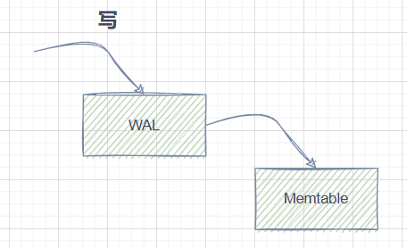
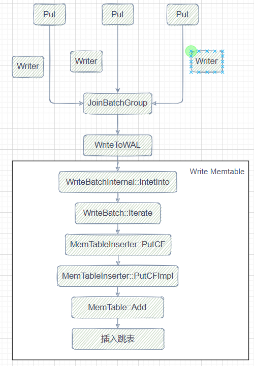
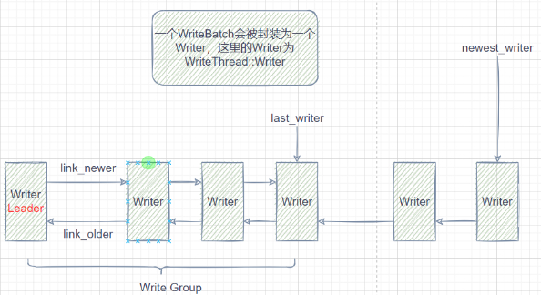
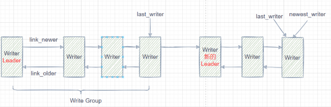

当前笔记参考的作者是dgpp_programer，主要是他的[写性能最强的kv数据库RocksDB全集详解](https://www.bilibili.com/video/BV1vDWseEEys/?spm_id_from=333.999.0.0)系列

本文章同步到我的笔记：[https://github.com/HentaiYang/NoteBooks](https://github.com/HentaiYang/NoteBooks)

## 目录
* [一、写流程简介](#p1)
* [二、写流程源码解析](#p2)

---

# 一、写流程简介<a id="p1"></a>

写流程和之前笔记中给出的一样，先写WAL，再写Memtable：

<div align="center">  </div>

Rocksdb的写是分批次（batch）写，将多个写入放入一个batch，从batch中选出一个leader，其他则为follower，由leader负责这一batch的写入，并在写完后唤醒所有follower。

<div align="center">  </div>


一个WriteBatch被封装为一个WriteThread::Write，Write Group由双向链表组成（Leader和Follower），Write Group或Writer之间为单向链表，link_older由链表后方往leader方向，link_newer由leader指向链表后方。

<div align="center">  </div>

当前Group写入后，将后面的Writer组建Group，并参与写入。

<div align="center">  </div>

# 二、写流程源码解析<a id="p2"></a>

接口：

```cpp
// 四个接口，分为带时间戳ts和不带的、直接用默认列族和指定列族的
// 常用的是默认列族的
virtual Status Put(const WriteOptions& options,
                   ColumnFamilyHandle* column_family, const Slice& key,
                   const Slice& value) = 0;
virtual Status Put(const WriteOptions& options,
                   ColumnFamilyHandle* column_family, const Slice& key,
                   const Slice& ts, const Slice& value) = 0;
virtual Status Put(const WriteOptions& options, const Slice& key,
                   const Slice& value) {
  return Put(options, DefaultColumnFamily(), key, value);
}
virtual Status Put(const WriteOptions& options, const Slice& key,
                   const Slice& ts, const Slice& value) {
  return Put(options, DefaultColumnFamily(), key, ts, value);
}
```

四个接口最终都会调用到DBImpl::Write方法：

```cpp
// 不带时间戳的
Status DB::Put(const WriteOptions& opt, ColumnFamilyHandle* column_family,
               const Slice& key, const Slice& value) {
  // 直接将key value封装到一个batch内参与写入
  // header占8字节, count占4字节, type占1字节
  // 额外11字节用于key长度和value长度
  WriteBatch batch(key.size() + value.size() + 24, 0 /* 最大字节数 */,
                   opt.protection_bytes_per_key, 0 /* 默认时间戳大小 */);
  Status s = batch.Put(column_family, key, value);
  if (!s.ok()) {
    return s;
  }
  return Write(opt, &batch);
}

// 带时间戳的
Status DB::Put(const WriteOptions& opt, ColumnFamilyHandle* column_family,
               const Slice& key, const Slice& ts, const Slice& value) {
  ColumnFamilyHandle* default_cf = DefaultColumnFamily();
  assert(default_cf);
  const Comparator* const default_cf_ucmp = default_cf->GetComparator();
  assert(default_cf_ucmp);
  WriteBatch batch(0 /* reserved_bytes */, 0 /* max_bytes */,
                   opt.protection_bytes_per_key,
                   default_cf_ucmp->timestamp_size());
  Status s = batch.Put(column_family, key, ts, value);
  if (!s.ok()) {
    return s;
  }
  return Write(opt, &batch);
}

// Put方法最终调用Write，进入WriteImpl方法
Status DBImpl::Write(const WriteOptions& write_options, WriteBatch* my_batch) {
  Status s;
  if (write_options.protection_bytes_per_key > 0) {
    s = WriteBatchInternal::UpdateProtectionInfo(
        my_batch, write_options.protection_bytes_per_key);
  }
  if (s.ok()) {
    s = WriteImpl(write_options, my_batch, /*callback=*/nullptr,
                  /*log_used=*/nullptr);
  }
  return s;
}
```
WriteImpl方法首先将leader writer和其他Writer（Follower）分流，通过JoinBatchGroup休眠Follower，leader会办以下事情：

	唤醒writers_中之前没被唤醒的任务，在本batch中一并执行
	PreprocessWrite：
		确认WAL是否满，满则切换WAL文件
		确认MemTable是否满，满则Flush
	EnterAsBatchGroupLeader：
		group成员、group大小
		writer个数和链接、last_writer_位置
	统计写入信息、确认MemTable是否可以并发写入
	配置写操作追踪
	计算写入消耗的seq
	写入WAL文件
	给当前Write Group每个Writer配置seq
	通过InsertInto写入MemTable
	更新Version的最大seq
	收尾工作，包括唤醒所有writer

Follower则执行JoinBatchGroup后就等待唤醒，被唤醒后记录log和seq使用情况后便直接返回。
	
```cpp
Status DBImpl::WriteImpl(一大堆参数) {
  ...
  WriteThread::Writer w(write_options, my_batch, callback, log_ref,
                        disable_memtable, batch_cnt, pre_release_callback,
                        post_memtable_callback);
  StopWatch write_sw(immutable_db_options_.clock, stats_, DB_WRITE);

  // 该函数称为leader的w返回，否则在内部阻塞等待唤醒
  write_thread_.JoinBatchGroup(&w);
  if (w.state == WriteThread::STATE_PARALLEL_MEMTABLE_WRITER) {
// 并发写Memtable情况，默认没启用 ...
  }
  if (w.state == WriteThread::STATE_COMPLETED) {
    // follower被唤醒后进入这里返回写操作完成
    if (log_used != nullptr) {
      *log_used = w.log_used;
    }
    if (seq_used != nullptr) {
      *seq_used = w.sequence;
    }
    return w.FinalStatus();
  }
  // 只有leader会执行到这里
  assert(w.state == WriteThread::STATE_GROUP_LEADER);
  Status status;
  // leader在执行写时可能将writers_中的未唤醒任务一并在本batch中执行
  WriteContext write_context;
  LogContext log_context(write_options.sync);
  WriteThread::WriteGroup write_group;
  bool in_parallel_group = false;
  uint64_t last_sequence = kMaxSequenceNumber;

  assert(!two_write_queues_ || !disable_memtable);
  {
    // 写入前的准备工作
    // WAL文件是否超过max_total_wal_size，是则切换WAL文件
    // memtable占用内存超过阈值则需要flush

    // 预处理写入计时器
PERF_TIMER_STOP(write_pre_and_post_process_time);

    status = PreprocessWrite(write_options, &log_context, &write_context);
    if (!two_write_queues_) {
      // 获取最新version的last sequence
      last_sequence = versions_->LastSequence();
	}

    PERF_TIMER_START(write_pre_and_post_process_time);
  }

  // 完成group成员确定：group大小、writer个数和连接、last_writer_位置
  TEST_SYNC_POINT("DBImpl::WriteImpl:BeforeLeaderEnters");
  last_batch_group_size_ =
      write_thread_.EnterAsBatchGroupLeader(&w, &write_group);

  IOStatus io_s;
  Status pre_release_cb_status;
  if (status.ok()) {
    // 统计写入的概要信息，决定memtable是否可以并发写入
    bool parallel = immutable_db_options_.allow_concurrent_memtable_write &&
                    write_group.size > 1;
    size_t total_count = 0;
    size_t valid_batches = 0;
    size_t total_byte_size = 0;
    size_t pre_release_callback_cnt = 0;
    for (auto* writer : write_group) {
      assert(writer);
      if (writer->CheckCallback(this)) {
        valid_batches += writer->batch_cnt;
        if (writer->ShouldWriteToMemtable()) {
          total_count += WriteBatchInternal::Count(writer->batch);
          total_byte_size = WriteBatchInternal::AppendedByteSize(
              total_byte_size, WriteBatchInternal::ByteSize(writer->batch));
          parallel = parallel && !writer->batch->HasMerge();
        }
        if (writer->pre_release_callback) {
          pre_release_callback_cnt++;
        }
      }
    }
    // 写操作追踪，确保操作顺序
    if (tracer_) {
      InstrumentedMutexLock lock(&trace_mutex_);
      if (tracer_ && tracer_->IsWriteOrderPreserved()) {
        for (auto* writer : write_group) {
          if (writer->CallbackFailed()) {
            continue;
          }
          tracer_->Write(writer->batch).PermitUncheckedError();
        }
      }
    }
    // 计算本次写入消耗的seq
size_t seq_inc = seq_per_batch_ ? valid_batches : total_count;
...
    if (!two_write_queues_) {
      if (status.ok() && !write_options.disableWAL) {
        assert(log_context.log_file_number_size);
        LogFileNumberSize& log_file_number_size =
            *(log_context.log_file_number_size);
        PERF_TIMER_GUARD(write_wal_time);
// 写WAL
        io_s =
            WriteToWAL(write_group, log_context.writer, log_used,
                       log_context.need_log_sync, log_context.need_log_dir_sync,
                       last_sequence + 1, log_file_number_size);
      }
    } else {
      ...
    }
    status = io_s;
    assert(last_sequence != kMaxSequenceNumber);
    const SequenceNumber current_sequence = last_sequence + 1;
    last_sequence += seq_inc;

    // PreReleaseCallback is called after WAL write and before memtable write
    if (status.ok()) {
      SequenceNumber next_sequence = current_sequence;
      size_t index = 0;
      // Note: the logic for advancing seq here must be consistent with the
      // logic in WriteBatchInternal::InsertInto(write_group...) as well as
      // with WriteBatchInternal::InsertInto(write_batch...) that is called on
      // the merged batch during recovery from the WAL.
      for (auto* writer : write_group) {
        if (writer->CallbackFailed()) {
          continue;
        }
    // 为每个操作赋值sequence
        writer->sequence = next_sequence;
        ...
      }
	}

    if (status.ok()) {
      PERF_TIMER_GUARD(write_memtable_time);

      if (!parallel) {
        // 写memtable
        w.status = WriteBatchInternal::InsertInto(
            write_group, current_sequence, column_family_memtables_.get(),
            &flush_scheduler_, &trim_history_scheduler_,
            write_options.ignore_missing_column_families,
            0 /*recovery_log_number*/, this, parallel, seq_per_batch_,
            batch_per_txn_);
      } else {
        ...
      }
      if (seq_used != nullptr) {
        *seq_used = w.sequence;
      }
    }
  }
  PERF_TIMER_START(write_pre_and_post_process_time);
  ...
  // 是否需要下刷WAL文件，默认False
  if (log_context.need_log_sync) {
    ...
  }
  bool should_exit_batch_group = true;
  ...
  if (should_exit_batch_group) {
    if (status.ok()) {
      for (auto* tmp_w : write_group) {
        assert(tmp_w);
        if (tmp_w->post_memtable_callback) {
          Status tmp_s =
              (*tmp_w->post_memtable_callback)(last_sequence, disable_memtable);
          assert(tmp_s.ok());
        }
      }
      // 更新version的last_sequence
      versions_->SetLastSequence(last_sequence);
    }
    MemTableInsertStatusCheck(w.status);
    // 结束当前group的收尾工作，包括唤醒所有follower
    write_thread_.ExitAsBatchGroupLeader(write_group, status);
  }

  if (status.ok()) {
    status = w.FinalStatus();
  }
  return status;
}
```

JoinBatchGroup会先将Writer放到双向链表尾部，然后设置Leader状态，不是Leader则进入AwaitState等待。

其中LinkOne为插入链表方法，如果出现Write Stall则会休眠等待唤醒。

```cpp
void WriteThread::JoinBatchGroup(Writer* w) {
  assert(w->batch != nullptr);
  // 将新的writer放到链表尾部（newest_writer_后面）
  bool linked_as_leader = LinkOne(w, &newest_writer_);
  // 如果link后是leader，则将该w设置为LEADER状态
  if (linked_as_leader) {
    SetState(w, STATE_GROUP_LEADER);
  }

  // 如果不是leader，就阻塞等待，直到w成为leader或被唤醒
  if (!linked_as_leader) {
    AwaitState(w,
               STATE_GROUP_LEADER | STATE_MEMTABLE_WRITER_LEADER |
                   STATE_PARALLEL_MEMTABLE_WRITER | STATE_COMPLETED,
               &jbg_ctx);
  }
}

bool WriteThread::LinkOne(Writer* w, std::atomic<Writer*>* newest_writer) {
  Writer* writers = newest_writer->load(std::memory_order_relaxed);
  while (true) {
    // 出现write_stall就会休眠等待唤醒
    if (writers == &write_stall_dummy_) {
      ...
}
// 将新的写入w添加到newest_writer后面
w->link_older = writers;
// 如果writers等于newest_writer，九江w赋值给newest_writer
if (newest_writer->compare_exchange_weak(writers, w)) {
  // writers为空则w为第一个writer，成为leader
      return (writers == nullptr);
    }
  }
}
```

Leader通过EnterAsBatchGroupLeader完成group成员确定：group大小、writer个数和连接、last_writer_位置。

```cpp
size_t WriteThread::EnterAsBatchGroupLeader(Writer* leader,
                                            WriteGroup* write_group) {
  // 调整max_size，避免全是小kv出现等待过久达到max_size的情况
  size_t size = WriteBatchInternal::ByteSize(leader->batch);
  size_t max_size = max_write_batch_group_size_bytes;
  const uint64_t min_batch_size_bytes = max_write_batch_group_size_bytes / 8;
  if (size <= min_batch_size_bytes) {
    max_size = size + min_batch_size_bytes;
  }
  // 创建write_group，头尾指针都指向leader，group大小为1
  leader->write_group = write_group;
  write_group->leader = leader;
  write_group->last_writer = leader;
  write_group->size = 1;
  // 从最新的writer开始（newest_writer），连接1组group的writer
  Writer* newest_writer = newest_writer_.load(std::memory_order_acquire);

  CreateMissingNewerLinks(newest_writer);

  Writer* w = leader;
  // 只要当前w不是newest_writer就会一直循环
  while (w != newest_writer) {
	w = w->link_newer;
	// 很多if-break，判断follower和leader之间：
	// 需要同步的writer不能放在不支持同步leader的batch中
	// 是否允许延迟标志必须相同
	// 是否禁用WAL标志必须相同 
	// protection_bytes_per_key必须相同
	// 速率限制器优先级必须相同
	// writer的batch必须不为空
	// writer的回调(callback)不为空时，leader必须允许批处理
	// 当前写操作大小(size + batch_size)需要<=max_size
	...
	// 更新group大小和last_writer位置
    w->write_group = write_group;
    size += batch_size;
    write_group->last_writer = w;
    write_group->size++;
  }
  return size;
}

void WriteThread::CreateMissingNewerLinks(Writer* head) {
  // 从后向前，将所有writer用link_older连起来
  while (true) {
    Writer* next = head->link_older;
    if (next == nullptr || next->link_newer != nullptr) {
      assert(next == nullptr || next->link_newer == head);
      break;
    }
    next->link_newer = head;
    head = next;
  }
}
```

Leader的收尾工作在ExitAsBatchGroupLeader中实现，包括加入新的Writer、断开当前Group与新Writer连接、确定新Leader、唤醒当前Group其他Writer。

```cpp
void WriteThread::ExitAsBatchGroupLeader(WriteGroup& write_group,
                                         Status& status) {
  Writer* leader = write_group.leader;
  Writer* last_writer = write_group.last_writer;
  ...
  if (enable_pipelined_write_) {
    ...
  } else {
    Writer* head = newest_writer_.load(std::memory_order_acquire);
    if (head != last_writer ||
        !newest_writer_.compare_exchange_strong(head, nullptr)) {
      // 当前group写入期间可能有新的writer，将其双向连接
      CreateMissingNewerLinks(head);
      // 新的group的leader与当前group的last_writer断开older关系
      last_writer->link_newer->link_older = nullptr;
      // 设置当前group的last_writer的下一个writer为下一个group的leader
      SetState(last_writer->link_newer, STATE_GROUP_LEADER);
    }
    // 遍历当前group，设置状态为STATE_COMPLETED，唤醒其他writer
    while (last_writer != leader) {
      last_writer->status = status;
      auto next = last_writer->link_older;
      SetState(last_writer, STATE_COMPLETED);
      last_writer = next;
    }
  }
}
```
