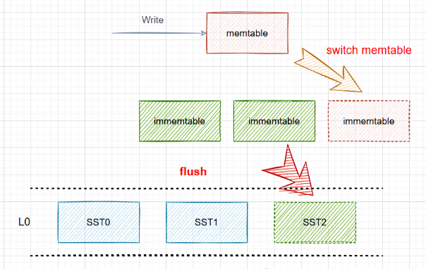
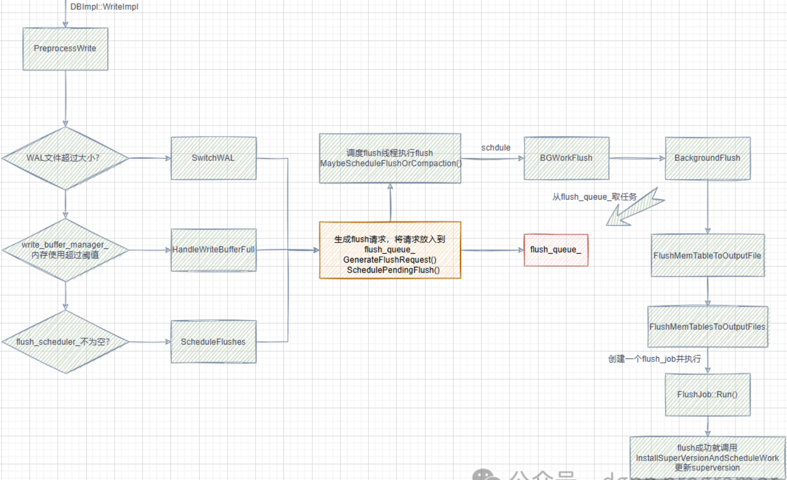

当前笔记参考的作者是dgpp_programer，主要是他的[写性能最强的kv数据库RocksDB全集详解](https://www.bilibili.com/video/BV1vDWseEEys/?spm_id_from=333.999.0.0)系列

本文章同步到我的笔记：[https://github.com/HentaiYang/NoteBooks](https://github.com/HentaiYang/NoteBooks)

---

**学习笔记：《RocksDB学习笔记》索引**
[RocksDB学习笔记#1 基本概念和简单使用](https://blog.csdn.net/qq_38876396/article/details/143467285)
[RocksDB学习笔记#2 SST、列族、Version、布隆过滤器](https://blog.csdn.net/qq_38876396/article/details/143469050)
[RocksDB学习笔记#3 写流程](https://blog.csdn.net/qq_38876396/article/details/143469414)
[RocksDB学习笔记#4 读流程](https://blog.csdn.net/qq_38876396/article/details/143469892)
[RocksDB学习笔记#5 Flush流程](https://blog.csdn.net/qq_38876396/article/details/143470573)
[RocksDB学习笔记#6 Compaction流程(1) —— 触发流程](https://blog.csdn.net/qq_38876396/article/details/143475637)
[RocksDB学习笔记#7 Compaction流程(2) —— 执行流程](https://blog.csdn.net/qq_38876396/article/details/143478199)

---

## 目录
* [1.Flush](#p1)
* [2.Flush源码解析](#p2)
* &nbsp;&nbsp;[2.1.PreprocessWrite中的Flush尝试](#p21)
* &nbsp;&nbsp;&nbsp;&nbsp;[2.1.1.SwitchWAL](#211)
* &nbsp;&nbsp;&nbsp;&nbsp;[2.1.2.HandleWriteBufferManagerFlush](#212)
* &nbsp;&nbsp;&nbsp;&nbsp;[2.1.3.ScheduleFlushes](#213)
* &nbsp;&nbsp;&nbsp;&nbsp;[2.1.4.三个函数都会调用的操作](#214)
* &nbsp;&nbsp;[2.2.Flush任务全流程-MaybeScheduleFlushOrCompaction()](#p22)
* &nbsp;&nbsp;&nbsp;&nbsp;[2.2.1.准备、执行和收尾-BGWorkFlush](#221)
* &nbsp;&nbsp;&nbsp;&nbsp;&nbsp;&nbsp;[2.2.1.1.取出Flush请求-BackgroundFlush](#2211)
* &nbsp;&nbsp;&nbsp;&nbsp;&nbsp;&nbsp;[2.2.1.2.产生Flush任务-FlushMemTablesToOutputFiles](#2212)
* &nbsp;&nbsp;&nbsp;&nbsp;&nbsp;&nbsp;[2.2.1.3执行Flush任务-FlushJob::Run](#2213)

---

# 1.Flush<a id="p1"></a>
Flush是将内存中的immemtable list数据合并，生成SST文件落盘。

<div align="center">  </div>

PreprocessWrite用于：

	检查WAL文件大小并可能切换WAL
	检查内存（写缓冲区）超限并可能刷新写缓冲区检查是否需要Flush操作并可能调度Flush
	
三者会生成或调度Flush请求，存在flush_queue_中，由MaybeScheduleFlushOrCompaction()进行调度，Flush请求调度到BGWorkFlush->后面如图：

<div align="center">  </div>

Flush流程关键配置：

	Write_buffer_size：单个memtable大小
	Db_write_buffer_size：DB内所有memtable的总大小（包括不同列族）
	Max_write_buffer_number：某个列族最大memtable数量，超过就会触发write stall


# 2.Flush源码解析<a id="p2"></a>
## 2.1.PreprocessWrite中的Flush尝试<a id="p21"></a>

在WriteImpl流程会通过ProprocessWrite尝试进行Flush，其先判断是否需要切换WAL文件，如果需要切换WAL文件，则会有Flush任务产生；然后判断目前内存使用情况是否需要Flush，但默认情况下是不启用的；最后flush_scheduler_中如果有Flush任务，则会通过ScheduleFlushes调度Flush。

```cpp
Status DBImpl::PreprocessWrite(const WriteOptions& write_options,
                               LogContext* log_context,
                               WriteContext* write_context) {
  // 如果不是单列族并且当前WAL超过大小上限则切换WAL
  if (UNLIKELY(status.ok() && total_log_size_ > GetMaxTotalWalSize())) {
    InstrumentedMutexLock l(&mutex_);
    const ColumnFamilySet* const column_families =
        versions_->GetColumnFamilySet();
    size_t num_cfs = column_families->NumberOfColumnFamilies();
    if (num_cfs > 1) {
      // 等待其他写入线程写入完成才切换WAL（开启pipeline写才会等待）
      // 不开启pipeline是单线程，可以直接写
      WaitForPendingWrites();
      status = SwitchWAL(write_context);
    }
  }
  // write_buffer_manager_是否启用由db_write_buffer_size决定，默认为0，不启用
  // write_buffer_manager_根据当前内存使用情况决定是否flush
  if (UNLIKELY(status.ok() && write_buffer_manager_->ShouldFlush())) {
    // 默认不启用
    InstrumentedMutexLock l(&mutex_);
    WaitForPendingWrites();
    status = HandleWriteBufferManagerFlush(write_context);
  }
  // trim_history_scheduler_队列里存放着已经flush但还没有删除的immemtable
  if (UNLIKELY(status.ok() && !trim_history_scheduler_.Empty())) {
	InstrumentedMutexLock l(&mutex_);
	// 删除所有immemtable
    status = TrimMemtableHistory(write_context);
  }

  if (UNLIKELY(status.ok() && !flush_scheduler_.Empty())) {
    InstrumentedMutexLock l(&mutex_);
	WaitForPendingWrites();
	// 调度进行flush
    status = ScheduleFlushes(write_context);
  }

  if (UNLIKELY(status.ok() && (write_controller_.IsStopped() ||
                               write_controller_.NeedsDelay()))) {
	// 用上一轮时间预估本轮需要延迟多久写入
    InstrumentedMutexLock l(&mutex_);
    status = DelayWrite(last_batch_group_size_, write_thread_, write_options);
    PERF_TIMER_START(write_pre_and_post_process_time);
  }
  // 内存超限则触发Write Stall
  if (UNLIKELY(status.ok() && write_buffer_manager_->ShouldStall())) {
    default_cf_internal_stats_->AddDBStats(
        InternalStats::kIntStatsWriteBufferManagerLimitStopsCounts, 1,
        true /* concurrent */);
    if (write_options.no_slowdown) {
      status = Status::Incomplete("Write stall");
    } else {
      InstrumentedMutexLock l(&mutex_);
      WriteBufferManagerStallWrites();
    }
  }
  InstrumentedMutexLock l(&log_write_mutex_);
  if (status.ok() && log_context->need_log_sync) {
    // 如果开启sync，操作系统可能仅下刷到page cache，需要下刷到磁盘
    while (logs_.front().IsSyncing()) {
      log_sync_cv_.Wait();
    }
    for (auto& log : logs_) {
      log.PrepareForSync();
    }
  } else {
    log_context->need_log_sync = false;
  }
  log_context->writer = logs_.back().writer;
  log_context->need_log_dir_sync =
      log_context->need_log_dir_sync && !log_dir_synced_;
  log_context->log_file_number_size = std::addressof(alive_log_files_.back());

  return status;
}
```

### 2.1.1.SwitchWAL<a id="p211"></a>

PreprocessWAL会先判断是否需要切换WAL文件，如果需要，因为所有列族共享WAL文件，则落盘WAL文件前，先要将列族中现有所有immemtable和memtable进行Flush，并换新的memtable，最后尝试进行Flush调度。

```cpp
Status DBImpl::SwitchWAL(WriteContext* write_context) {
  ...
  // 选择需要切换memtable的列族
  autovector<ColumnFamilyData*> cfds;
  if (immutable_db_options_.atomic_flush) {
    // 将所有有immemtable或memtable有数据的列族放到cfds中
    // 所有列族共享WAL，所以切换前要先flush其中的数据
    SelectColumnFamiliesForAtomicFlush(&cfds);
  } else {
    for (auto cfd : *versions_->GetColumnFamilySet()) {
      if (cfd->IsDropped()) {
        continue;
      }
      // 列族下最早的一个WAL文件编号小于等于当前最早存活的WAL文件编号时都需要flush
      if (cfd->OldestLogToKeep() <= oldest_alive_log) {
        cfds.push_back(cfd);
      }
	}
	// 可能需要带上统计信息列族一起flush
    MaybeFlushStatsCF(&cfds);
  }
  WriteThread::Writer nonmem_w;
  if (two_write_queues_) {
    nonmem_write_thread_.EnterUnbatched(&nonmem_w, &mutex_);
  }

  for (const auto cfd : cfds) {
    // 对每个列族切换memtable
    cfd->Ref();
    status = SwitchMemtable(cfd, write_context);
    cfd->UnrefAndTryDelete();
    if (!status.ok()) {
      break;
    }
  }
  if (two_write_queues_) {
    nonmem_write_thread_.ExitUnbatched(&nonmem_w);
  }

  if (status.ok()) {
    if (immutable_db_options_.atomic_flush) {
      AssignAtomicFlushSeq(cfds);
    }
	for (auto cfd : cfds) {
  	  // 将flush_requested_置为true，表示该列族imm list已经请求了执行flush
      cfd->imm()->FlushRequested();
      if (!immutable_db_options_.atomic_flush) {
        // 生成flush_req_并放入flush_queue_队列
        FlushRequest flush_req;
        GenerateFlushRequest({cfd}, FlushReason::kWalFull, &flush_req);
        SchedulePendingFlush(flush_req);
      }
    }
    if (immutable_db_options_.atomic_flush) {
      FlushRequest flush_req;
      GenerateFlushRequest(cfds, FlushReason::kWalFull, &flush_req);
      SchedulePendingFlush(flush_req);
}
// 尝试启动flush或compaction任务
    MaybeScheduleFlushOrCompaction();
  }
  return status;
}
```

### 2.1.2.HandleWriteBufferManagerFlush<a id="p212"></a>
如果启用根据内存判断是否需要Flush，则内存满需要进行Flush时，PreprocessWrite会调用HandleWriteBufferManagerFlush，如果是原子性flush，则所有有immemtable或memtable有数据的黎族都会落盘，否则仅需落盘seq最小的列族，剩余操作与SwitchWAL一样。

```cpp
Status DBImpl::HandleWriteBufferManagerFlush(WriteContext* write_context) {
  ...
  autovector<ColumnFamilyData*> cfds;
  if (immutable_db_options_.atomic_flush) {
	// 将所有有immemtable或memtable有数据的列族放到cfds中
    SelectColumnFamiliesForAtomicFlush(&cfds);
  } else {
    ColumnFamilyData* cfd_picked = nullptr;
	SequenceNumber seq_num_for_cf_picked = kMaxSequenceNumber;
	// 选出所有列族最小的一个seq，内存满了只需要下刷一个列族即可
    for (auto cfd : *versions_->GetColumnFamilySet()) {
      if (cfd->IsDropped()) {
        continue;
      }
      // 需要memtable不为空，imm没有正在flush或使用
      if (!cfd->mem()->IsEmpty() && !cfd->imm()->IsFlushPendingOrRunning()) {
        uint64_t seq = cfd->mem()->GetCreationSeq();
        if (cfd_picked == nullptr || seq < seq_num_for_cf_picked) {
          cfd_picked = cfd;
          seq_num_for_cf_picked = seq;
        }
      }
    }
    if (cfd_picked != nullptr) {
      cfds.push_back(cfd_picked);
    }
	MaybeFlushStatsCF(&cfds);	// 可能需要带上统计信息列族一起flush
  }
  // 后面的逻辑和SwitchWAL一样 ...
}
```

### 2.1.3.ScheduleFlushes<a id="p213"></a>

当flush_scheduler_不为空时，PreprocessWrite会尝试进行Flush调度，其操作方式与前两个Flush方法相似：

```cpp
Status DBImpl::ScheduleFlushes(WriteContext* context) {
  autovector<ColumnFamilyData*> cfds;
  if (immutable_db_options_.atomic_flush) {
	// 将所有有immemtable或memtable有数据的列族放到cfds中
    SelectColumnFamiliesForAtomicFlush(&cfds);
    for (auto cfd : cfds) {
      cfd->Ref();
    }
    flush_scheduler_.Clear();
  } else {
	ColumnFamilyData* tmp_cfd;
	// 调用TakeNextColumnFamily不停的从flush_scheduler_里的head_链表取列族
    while ((tmp_cfd = flush_scheduler_.TakeNextColumnFamily()) != nullptr) {
      cfds.push_back(tmp_cfd);
    }
    MaybeFlushStatsCF(&cfds);  // 可能需要带上统计信息列族一起flush
  }
  Status status;
  WriteThread::Writer nonmem_w;
  if (two_write_queues_) {
    // 默认不启用
    nonmem_write_thread_.EnterUnbatched(&nonmem_w, &mutex_);
  }
  TEST_SYNC_POINT_CALLBACK("DBImpl::ScheduleFlushes:PreSwitchMemtable",
                           nullptr);
  for (auto& cfd : cfds) {
    // 需要memtable不为空，避免重入，比如某个cf切换后再没写过数据
    if (status.ok() && !cfd->mem()->IsEmpty()) {
      status = SwitchMemtable(cfd, context);
    }
    if (cfd->UnrefAndTryDelete()) {
      cfd = nullptr;
    }
  }

  if (two_write_queues_) {
    nonmem_write_thread_.ExitUnbatched(&nonmem_w);
  }
  // 后面的逻辑和SwitchWAL一样 ...
}
```

### 2.1.4.三个函数都会调用的操作<a id="p214"></a>

上面三个Flush操作殊途同归，很多代码是相似的，其都调用了以下函数。

MaybeFlushStatsCF()：rocksdb可以选择将各列族的统计信息写入到一个StatsCF列族中，如果开启了，则Flush时该列族也会一并落盘。

```cpp
// StatsCF来专门存储统计信息，有需求时启用
void DBImpl::MaybeFlushStatsCF(autovector<ColumnFamilyData*>* cfds) {
  assert(cfds != nullptr);
  // 如果传入的cfds不为空，并且启用了StatsCF，则尝试将该列族一起flush
  if (!cfds->empty() && immutable_db_options_.persist_stats_to_disk) {
    // 统计信息的列族名称为kPersistentStatsColumnFamilyName
    ColumnFamilyData* cfd_stats =
        versions_->GetColumnFamilySet()->GetColumnFamily(
            kPersistentStatsColumnFamilyName);
    if (cfd_stats != nullptr && !cfd_stats->mem()->IsEmpty()) {
      for (ColumnFamilyData* cfd : *cfds) {
        if (cfd == cfd_stats) {
          // StatsCF已经在cfds里了
          return;
        }
      }
      // 如果StatsCF不在cfds中，则确认StatsCF的WAL日志编号是否为所有列族最小
      bool force_flush_stats_cf = true;
      for (auto* loop_cfd : *versions_->GetColumnFamilySet()) {
        if (loop_cfd == cfd_stats) {
          // 无需与自己比较
          continue;
        }
        if (loop_cfd->GetLogNumber() <= cfd_stats->GetLogNumber()) {
          // 当前StatsCF的WAL编号不是最小的，无需强制flush
          force_flush_stats_cf = false;
        }
      }
      if (force_flush_stats_cf) {
        // 当前StatsCF的WAL编号是最小的，需要强制flush
        cfds->push_back(cfd_stats);
        ROCKS_LOG_INFO(immutable_db_options_.info_log,
                       "Force flushing stats CF with automated flush "
                       "to avoid holding old logs");
      }
    }
  }
}
```

SwitchMemtable()：落盘memtable有数据的列族时，需要切换新的memtable。

```cpp
// 切换memtable
Status DBImpl::SwitchMemtable(ColumnFamilyData* cfd, WriteContext* context) {
  ...
  // 将cached_recoverable_state_写入到memtable
  Status s = WriteRecoverableState();
  if (!s.ok()) {
    return s;
  }
  ...
  uint64_t recycle_log_number = 0;
  // 如果需要创建新的WAL文件，尝试从log_recycle_files_中获取可以复用的WAL文件
  if (creating_new_log && immutable_db_options_.recycle_log_file_num &&
      !log_recycle_files_.empty()) {
    recycle_log_number = log_recycle_files_.front();
  }
  uint64_t new_log_number =
      creating_new_log ? versions_->NewFileNumber() : logfile_number_;
  const MutableCFOptions mutable_cf_options = *cfd->GetLatestMutableCFOptions();
  // 收集一些信息到MemTableInfo对象中 ...
  // immemtable个数
  int num_imm_unflushed = cfd->imm()->NumNotFlushed();
  // 预先计算出要创建WAL文件大小（如果需要创建新WAL文件的话）
  const auto preallocate_block_size =
      GetWalPreallocateBlockSize(mutable_cf_options.write_buffer_size);
  mutex_.Unlock();
  if (creating_new_log) {
    // 创建WAL文件
    io_s = CreateWAL(write_options, new_log_number, recycle_log_number,
                     preallocate_block_size, &new_log);
    if (s.ok()) {
      s = io_s;
    }
  }
  if (s.ok()) {
    // 创建新的memtable
    SequenceNumber seq = versions_->LastSequence();
    new_mem = cfd->ConstructNewMemtable(mutable_cf_options, seq);
    context->superversion_context.NewSuperVersion();
  }
  cfd->mem()->ConstructFragmentedRangeTombstones();
  mutex_.Lock();
  if (recycle_log_number != 0) {
    assert(log_recycle_files_.front() == recycle_log_number);
    log_recycle_files_.pop_front();
  }

  if (s.ok() && creating_new_log) {
    InstrumentedMutexLock l(&log_write_mutex_);
    assert(new_log != nullptr);
    if (!logs_.empty()) {
      // Alway flush the buffer of the last log before switching to a new one
      log::Writer* cur_log_writer = logs_.back().writer;
      if (error_handler_.IsRecoveryInProgress()) {
        //  WAL文件下刷到操作系统或磁盘（WAL文件有一个缓冲区，控制每次写WAL文件是否要flush）
        cur_log_writer->file()->reset_seen_error();
      }
      io_s = cur_log_writer->WriteBuffer(write_options);
      if (s.ok()) {
        s = io_s;
      }
      if (!s.ok()) {
        ROCKS_LOG_WARN(immutable_db_options_.info_log,
                       "[%s] Failed to switch from #%" PRIu64 " to #%" PRIu64
                       "  WAL file\n",
                       cfd->GetName().c_str(), cur_log_writer->get_log_number(),
                       new_log_number);
      }
    }
    if (s.ok()) {
      logfile_number_ = new_log_number;
      log_empty_ = true;
      log_dir_synced_ = false;
      logs_.emplace_back(logfile_number_, new_log);
      alive_log_files_.push_back(LogFileNumberSize(logfile_number_));
    }
  }
  // 创建失败的操作
  if (!s.ok()) {
    // how do we fail if we're not creating new log?
    assert(creating_new_log);
    delete new_mem;
    delete new_log;
    context->superversion_context.new_superversion.reset();
    // We may have lost data from the WritableFileBuffer in-memory buffer for
    // the current log, so treat it as a fatal error and set bg_error
    if (!io_s.ok()) {
      error_handler_.SetBGError(io_s, BackgroundErrorReason::kMemTable);
    } else {
      error_handler_.SetBGError(s, BackgroundErrorReason::kMemTable);
    }
    // Read back bg_error in order to get the right severity
    s = error_handler_.GetBGError();
    return s;
  }

  cfd->mem()->SetNextLogNumber(logfile_number_);
  // 将memtable添加到immemtable
  cfd->imm()->Add(cfd->mem(), &context->memtables_to_free_);
  new_mem->Ref();
  // 设置刚创建的memtable为列族使用的memtable
  cfd->SetMemtable(new_mem);
  // 更新superversion，内部会尝试触发flush和compaction
  InstallSuperVersionAndScheduleWork(cfd, &context->superversion_context,
                                     mutable_cf_options);
  ...
  return s;
}
```

GenerateFlushRequest()：选择完所有需要Flush的列族后，由该函数统一生成Flush请求。

```cpp
// 遍历cfds，生成一批flush_req_
void DBImpl::GenerateFlushRequest(const autovector<ColumnFamilyData*>& cfds,
                                  FlushReason flush_reason, FlushRequest* req) {
  assert(req != nullptr);
  req->flush_reason = flush_reason;
  req->cfd_to_max_mem_id_to_persist.reserve(cfds.size());
  for (const auto cfd : cfds) {
    if (nullptr == cfd) {
      // cfd may be null, see DBImpl::ScheduleFlushes
      continue;
    }
    uint64_t max_memtable_id = cfd->imm()->GetLatestMemTableID(
        immutable_db_options_.atomic_flush /* for_atomic_flush */);
    req->cfd_to_max_mem_id_to_persist.emplace(cfd, max_memtable_id);
  }
}
```

SchedulePendingFlush()：上一个函数生成请求后，由该函数将任务放入到flush_queue_队列。

```cpp
// 将需要flush的任务放入到flush_queue_队列
void DBImpl::SchedulePendingFlush(const FlushRequest& flush_req) {
  mutex_.AssertHeld();
  if (reject_new_background_jobs_) {
    return;
  }
  if (flush_req.cfd_to_max_mem_id_to_persist.empty()) {
    return;
  }
  if (!immutable_db_options_.atomic_flush) {
    // For the non-atomic flush case, we never schedule multiple column
    // families in the same flush request.
    assert(flush_req.cfd_to_max_mem_id_to_persist.size() == 1);
    ColumnFamilyData* cfd =
        flush_req.cfd_to_max_mem_id_to_persist.begin()->first;
    assert(cfd);

    if (!cfd->queued_for_flush() && cfd->imm()->IsFlushPending()) {
      cfd->Ref();
      cfd->set_queued_for_flush(true);
      ++unscheduled_flushes_;
      flush_queue_.push_back(flush_req);
    }
  } else {
    for (auto& iter : flush_req.cfd_to_max_mem_id_to_persist) {
      ColumnFamilyData* cfd = iter.first;
      cfd->Ref();
    }
    ++unscheduled_flushes_;
    flush_queue_.push_back(flush_req);
  }
}
```

MaybeScheduleFlushOrCompaction()是三个函数最后调用的方法，会在下一节详细介绍。

---

## 2.2.Flush任务全流程-MaybeScheduleFlushOrCompaction()（重点）<a id="p22"></a>
在PreprocessWrite的三个产生Flush任务的函数的最后，都会调用MaybeScheduleFlushOrCompaction这一方法，这个方法在rocksdb的各处都有调用，这是为了系统中有flush或compaction任务时能够快速调度，该函数也是rocksdb的核心之一，本节将对其重点解析

rocksdb中有HIGH和LOW两种线程池，HIGH线程用于执行Flush，没有HIGH线程时，LOW线程优先用于执行Flush，以保证系统的高效率。线程具体执行的函数为BGWorkFlush，这也是Flush操作真正发生的入口。

```cpp
void DBImpl::MaybeScheduleFlushOrCompaction() {
  ...
  if (bg_work_paused_ > 0) {
    // 后台的flush和compaction可以暂停
    return;
  }
  // 还有两个导致直接return;的判断 ...
  auto bg_job_limits = GetBGJobLimits();
  bool is_flush_pool_empty =
      env_->GetBackgroundThreads(Env::Priority::HIGH) == 0;
  // 条件：1.HIGH线程池不为空（优先用HIGH线程执行flush），2.未执行的flush任务大于0，
  //       3.后台正常执行的flush任务小于后台限制执行的flush任务数
  while (!is_flush_pool_empty && unscheduled_flushes_ > 0 &&
         bg_flush_scheduled_ < bg_job_limits.max_flushes) {
    bg_flush_scheduled_++;
    FlushThreadArg* fta = new FlushThreadArg;
    fta->db_ = this;
	fta->thread_pri_ = Env::Priority::HIGH;
	// 使用HIGH线程执行Flush
    env_->Schedule(&DBImpl::BGWorkFlush, fta, Env::Priority::HIGH, this,
                   &DBImpl::UnscheduleFlushCallback);
    --unscheduled_flushes_;
  }

  // 如果HIGH线程池为空，并且有待flush任务、后台flush和compaction任务总数小于上限
  // 则可以用LOW线程执行flush，保证优先执行flush，确保写性能
  if (is_flush_pool_empty) {
    while (unscheduled_flushes_ > 0 &&
           bg_flush_scheduled_ + bg_compaction_scheduled_ <
               bg_job_limits.max_flushes) {
      bg_flush_scheduled_++;
      FlushThreadArg* fta = new FlushThreadArg;
      fta->db_ = this;
      fta->thread_pri_ = Env::Priority::LOW;
      env_->Schedule(&DBImpl::BGWorkFlush, fta, Env::Priority::LOW, this,
                     &DBImpl::UnscheduleFlushCallback);
      --unscheduled_flushes_;
    }
  }
  // 如果后台有单独停止的compaction任务，则返回而不停止flush任务
  if (bg_compaction_paused_ > 0) {
    // we paused the background compaction
    return;
  } else if (error_handler_.IsBGWorkStopped()) {
    // Compaction is not part of the recovery sequence from a hard error. We
    // might get here because recovery might do a flush and install a new
    // super version, which will try to schedule pending compactions. Bail
    // out here and let the higher level recovery handle compactions
    return;
  }

  if (HasExclusiveManualCompaction()) {
    // manual compaction可以独占任务，其他compaction无法执行
    TEST_SYNC_POINT("DBImpl::MaybeScheduleFlushOrCompaction:Conflict");
    return;
  }
  // 如果有可以调度的compaction，并且总任务数小于上限，则用LOW线程执行compaction
  while (bg_compaction_scheduled_ + bg_bottom_compaction_scheduled_ <
             bg_job_limits.max_compactions &&
         unscheduled_compactions_ > 0) {
    CompactionArg* ca = new CompactionArg;
    ca->db = this;
    ca->compaction_pri_ = Env::Priority::LOW;
    ca->prepicked_compaction = nullptr;
    bg_compaction_scheduled_++;
    unscheduled_compactions_--;
    env_->Schedule(&DBImpl::BGWorkCompaction, ca, Env::Priority::LOW, this,
                   &DBImpl::UnscheduleCompactionCallback);
  }
}
```

### 2.2.1.准备、执行和收尾-BGWorkFlush<a id="p221"></a>

MaybeScheduleFlushOrCompaction会调度BGWorkFlush函数，拷贝传递的参数后，通过调用BackgroundCallFlush，再调用BackgroundFlush，别急，在进行真正的Flush之前还得再往里走几层。

BackgroundCallFlush会进行Flush前的预处理、BackgroundFlush的调度和Flush的收尾工作：

```cpp
void DBImpl::BGWorkFlush(void* arg) {
  FlushThreadArg fta = *(static_cast<FlushThreadArg*>(arg));
  delete static_cast<FlushThreadArg*>(arg);

  IOSTATS_SET_THREAD_POOL_ID(fta.thread_pri_);
  TEST_SYNC_POINT("DBImpl::BGWorkFlush");
  // 进入BackgroundCallFlush
  static_cast_with_check<DBImpl>(fta.db_)->BackgroundCallFlush(fta.thread_pri_);
  TEST_SYNC_POINT("DBImpl::BGWorkFlush:done");
}

void DBImpl::BackgroundCallFlush(Env::Priority thread_pri) {
  bool made_progress = false;
  JobContext job_context(next_job_id_.fetch_add(1), true);
  LogBuffer log_buffer(InfoLogLevel::INFO_LEVEL,
                       immutable_db_options_.info_log.get());
  {
    InstrumentedMutexLock l(&mutex_);
    assert(bg_flush_scheduled_);
	num_running_flushes_++;
	// 记录flush的文件number，完成后从pending_outputs_里删除
    std::unique_ptr<std::list<uint64_t>::iterator>
        pending_outputs_inserted_elem(new std::list<uint64_t>::iterator(
            CaptureCurrentFileNumberInPendingOutputs()));
    FlushReason reason;
	bool flush_rescheduled_to_retain_udt = false;
	// 执行Flush
    Status s =
        BackgroundFlush(&made_progress, &job_context, &log_buffer, &reason,
                        &flush_rescheduled_to_retain_udt, thread_pri);
    if (s.IsTryAgain() && flush_rescheduled_to_retain_udt) {
      bg_cv_.SignalAll();  // In case a waiter can proceed despite the error
      mutex_.Unlock();
      TEST_SYNC_POINT_CALLBACK("DBImpl::AfterRetainUDTReschedule:cb", nullptr);
      immutable_db_options_.clock->SleepForMicroseconds(
          100000);  // prevent hot loop
      mutex_.Lock();
    } else if (!s.ok() && !s.IsShutdownInProgress() &&
               !s.IsColumnFamilyDropped() &&
               reason != FlushReason::kErrorRecovery) {
	  // Wait a little bit before retrying background flush in
      // case this is an environmental problem and we do not want to
      // chew up resources for failed flushes for the duration of
      // the problem.
      // Flush失败
      uint64_t error_cnt =
          default_cf_internal_stats_->BumpAndGetBackgroundErrorCount();
      bg_cv_.SignalAll();  // In case a waiter can proceed despite the error
      mutex_.Unlock();
      ROCKS_LOG_ERROR(immutable_db_options_.info_log,
                      "[JOB %d] Waiting after background flush error: %s"
                      "Accumulated background error counts: %" PRIu64,
                      job_context.job_id, s.ToString().c_str(), error_cnt);
      log_buffer.FlushBufferToLog();
      LogFlush(immutable_db_options_.info_log);
      immutable_db_options_.clock->SleepForMicroseconds(1000000);
      mutex_.Lock();
	}

	TEST_SYNC_POINT("DBImpl::BackgroundCallFlush:FlushFinish:0");
	// 从pending_outputs_中删除记录的number
    ReleaseFileNumberFromPendingOutputs(pending_outputs_inserted_elem);
    if (!flush_rescheduled_to_retain_udt) {
      // 如果flush失败，需要获取所有临时文件用于删除
      FindObsoleteFiles(&job_context, !s.ok() && !s.IsShutdownInProgress() &&
                                          !s.IsColumnFamilyDropped());
    }
    // delete unnecessary files if any, this is done outside the mutex
    if (job_context.HaveSomethingToClean() ||
        job_context.HaveSomethingToDelete() || !log_buffer.IsEmpty()) {
      mutex_.Unlock();
      // 刷日志
      log_buffer.FlushBufferToLog();
      if (job_context.HaveSomethingToDelete()) {
        // 删除临时文件
        PurgeObsoleteFiles(job_context);
      }
      job_context.Clean();
      mutex_.Lock();
    }
	TEST_SYNC_POINT("DBImpl::BackgroundCallFlush:ContextCleanedUp");

    assert(num_running_flushes_ > 0);
    num_running_flushes_--;
    bg_flush_scheduled_--;
    // 再次尝试调度，确认是否有其他任务
    MaybeScheduleFlushOrCompaction();
	atomic_flush_install_cv_.SignalAll();
	// 尝试唤醒
    bg_cv_.SignalAll();
  }
}
```

#### 2.2.1.1.取出Flush请求-BackgroundFlush<a id="p2211"></a>

这一步会取出flush_queue_中先前调度的所有flush请求，放入到bg_flush_args，如果遇到任何导致不能刷新的问题，则直接返回。确保flush任务数不超过上限后，通过FlushMemTablesToOutputFiles将所有memtable（immemtable，因为已经切换过memtable了，所以目前落盘的memtable都是immemtable）落盘为sst文件，已经取出Flush请求了，执行还会远吗？再往里一层吧：

```cpp
Status DBImpl::BackgroundFlush(bool* made_progress, JobContext* job_context,
                               LogBuffer* log_buffer, FlushReason* reason,
                               bool* flush_rescheduled_to_retain_udt,
                               Env::Priority thread_pri) {
  ...
  // 取出flush_queue_中的所有flush请求，放入到bg_flush_args
  while (!flush_queue_.empty()) {
    // This cfd is already referenced
    FlushRequest flush_req = PopFirstFromFlushQueue();
    FlushReason flush_reason = flush_req.flush_reason;
    // 各种导致不能进行刷新的原因，return ...
    superversion_contexts.clear();
    superversion_contexts.reserve(
        flush_req.cfd_to_max_mem_id_to_persist.size());
   
    for (const auto& [cfd, max_memtable_id] :
         flush_req.cfd_to_max_mem_id_to_persist) {
      // 如果列族启用MemPurge（内存清除），则标记为已请求Flush
      if (cfd->GetMempurgeUsed()) {
        cfd->imm()->FlushRequested();
      }
      // 如果列族被删除，或列族的immemtable不在flush pending队列中，则不能flush该列族
      if (cfd->IsDropped() || !cfd->imm()->IsFlushPending()) {
        column_families_not_to_flush.push_back(cfd);
        continue;
      }
      superversion_contexts.emplace_back(SuperVersionContext(true));
      bg_flush_args.emplace_back(cfd, max_memtable_id,
                                 &(superversion_contexts.back()), flush_reason);
	}

    if (!bg_flush_args.empty() || !column_families_not_to_flush.empty()) {
      TEST_SYNC_POINT_CALLBACK("DBImpl::BackgroundFlush:CheckFlushRequest:cb",
                               const_cast<int*>(&flush_req.reschedule_count));
      break;
    }
  }

  if (!bg_flush_args.empty()) {
    // 是否超过flush个数限制
    auto bg_job_limits = GetBGJobLimits();
    for (const auto& arg : bg_flush_args) {
      ColumnFamilyData* cfd = arg.cfd_;
      ROCKS_LOG_BUFFER(
          log_buffer,
          "Calling FlushMemTableToOutputFile with column "
          "family [%s], flush slots available %d, compaction slots available "
          "%d, "
          "flush slots scheduled %d, compaction slots scheduled %d",
          cfd->GetName().c_str(), bg_job_limits.max_flushes,
          bg_job_limits.max_compactions, bg_flush_scheduled_,
          bg_compaction_scheduled_);
	}
	// 将memtable刷到SST文件
    status = FlushMemTablesToOutputFiles(bg_flush_args, made_progress,
                                         job_context, log_buffer, thread_pri);
	...
	// flush的原因，用于打日志
    *reason = bg_flush_args[0].flush_reason_;
    for (auto& arg : bg_flush_args) {
      ColumnFamilyData* cfd = arg.cfd_;
      if (cfd->UnrefAndTryDelete()) {
        arg.cfd_ = nullptr;
      }
    }
  }
  for (auto cfd : column_families_not_to_flush) {
    cfd->UnrefAndTryDelete();
  }
  return status;
}
```

### 2.2.1.2.产生Flush任务-FlushMemTablesToOutputFiles<a id="p2212"></a>

确定刷新任务后，本函数用来将列族中所有immemtable写为sst文件，其处理参数信息后，调用FlushMemTableToOutputFile将所有immemtable写入一个sst文件中：

```cpp
Status DBImpl::FlushMemTablesToOutputFiles(
    const autovector<BGFlushArg>& bg_flush_args, bool* made_progress,
    JobContext* job_context, LogBuffer* log_buffer, Env::Priority thread_pri) {
  if (immutable_db_options_.atomic_flush) {
    // 原子下刷memtable，默认不启用
    return AtomicFlushMemTablesToOutputFiles(
        bg_flush_args, made_progress, job_context, log_buffer, thread_pri);
  }
  assert(bg_flush_args.size() == 1);
  std::vector<SequenceNumber> snapshot_seqs;
  SequenceNumber earliest_write_conflict_snapshot;
  SnapshotChecker* snapshot_checker;
  GetSnapshotContext(job_context, &snapshot_seqs,
                     &earliest_write_conflict_snapshot, &snapshot_checker);
  // 新版本似乎将遍历bg_flush_args改成了指定头指针的方式
  const auto& bg_flush_arg = bg_flush_args[0];
  // BGFlushArg结构体一共四个成员变量，包括下面三个和max_memtable_id
  ColumnFamilyData* cfd = bg_flush_arg.cfd_;
  MutableCFOptions mutable_cf_options_copy = *cfd->GetLatestMutableCFOptions();
  SuperVersionContext* superversion_context =
      bg_flush_arg.superversion_context_;
  FlushReason flush_reason = bg_flush_arg.flush_reason_;
  Status s = FlushMemTableToOutputFile(
      cfd, mutable_cf_options_copy, made_progress, job_context, flush_reason,
      superversion_context, snapshot_seqs, earliest_write_conflict_snapshot,
      snapshot_checker, log_buffer, thread_pri);
  return s;
}
```

在FlushMemTableToOutputFile中，会将取出的Flush请求生成一个Flush job，初始化之后执行Run操作，最后固化Version和SuperVersion，同样是一个初始化-执行-收尾的结构：

```cpp
// 将所有immemtable刷到一个SST文件内
Status DBImpl::FlushMemTableToOutputFile(
    ColumnFamilyData* cfd, const MutableCFOptions& mutable_cf_options,
    bool* made_progress, JobContext* job_context, FlushReason flush_reason,
    SuperVersionContext* superversion_context,
    std::vector<SequenceNumber>& snapshot_seqs,
    SequenceNumber earliest_write_conflict_snapshot,
    SnapshotChecker* snapshot_checker, LogBuffer* log_buffer,
    Env::Priority thread_pri) {
  ...
  // 如果有多个列族，则确保除最新WAL文件之外的WAL文件同步
  // 否则如果崩溃发生在flush之后、WAL落盘之前，该sst文件可能包含某些CF的更新，
  // 但其他CF的更新还没被记录，导致数据不一致
  const bool needs_to_sync_closed_wals =
      logfile_number_ > 0 &&
      versions_->GetColumnFamilySet()->NumberOfColumnFamilies() > 1;

  // 有多个列族需要处理时，那么记录当前最新memtable的id，落盘不能处理比它大的memtable
  // 因为SyncCloseLogs()可能释放db互斥锁，而后可能产生新的memtable切换
  uint64_t max_memtable_id =
      needs_to_sync_closed_wals
          ? cfd->imm()->GetLatestMemTableID(false /* for_atomic_flush */)
          : std::numeric_limits<uint64_t>::max();
  // 处理单个列族时，flush会在PickMemTable()中刷新所有memtable
  // 不会调用SyncCloseLogs()，但仍然可能在NotifyOnFlushBegin()中释放和获取互斥锁
  // 互斥锁释放过程中，应用可能创建新的快照（记录数据库所有可见状态）
  // 为避免这样导致数据不一致，要保证NotifyOnFlushBegin()在memtable选择后执行

  // 生成一个flush任务
  FlushJob flush_job(
      dbname_, cfd, immutable_db_options_, mutable_cf_options, max_memtable_id,
      file_options_for_compaction_, versions_.get(), &mutex_, &shutting_down_,
      snapshot_seqs, earliest_write_conflict_snapshot, snapshot_checker,
      job_context, flush_reason, log_buffer, directories_.GetDbDir(),
      GetDataDir(cfd, 0U),
      GetCompressionFlush(*cfd->ioptions(), mutable_cf_options), stats_,
      &event_logger_, mutable_cf_options.report_bg_io_stats,
      true /* sync_output_directory */, true /* write_manifest */, thread_pri,
      io_tracer_, seqno_to_time_mapping_, db_id_, db_session_id_,
      cfd->GetFullHistoryTsLow(), &blob_callback_);
  FileMetaData file_meta;

  Status s;
  bool need_cancel = false;
  IOStatus log_io_s = IOStatus::OK();
  if (needs_to_sync_closed_wals) {
    // 有多个列族需要处理时，先进行同步（除最新WAL文件都落盘）
    VersionEdit synced_wals;
    bool error_recovery_in_prog = error_handler_.IsRecoveryInProgress();
	mutex_.Unlock();
	// 在此期间可能产生新的memtable
	// 对WAL文件落盘
    log_io_s = SyncClosedLogs(write_options, job_context, &synced_wals,
                              error_recovery_in_prog);
    mutex_.Lock();
    if (log_io_s.ok() && synced_wals.IsWalAddition()) {
      log_io_s = status_to_io_status(
          ApplyWALToManifest(read_options, write_options, &synced_wals));
      TEST_SYNC_POINT_CALLBACK("DBImpl::FlushMemTableToOutputFile:CommitWal:1",
                               nullptr);
}

    if (!log_io_s.ok() && !log_io_s.IsShutdownInProgress() &&
        !log_io_s.IsColumnFamilyDropped()) {
      error_handler_.SetBGError(log_io_s, BackgroundErrorReason::kFlush);
    }
  } else {
    TEST_SYNC_POINT("DBImpl::SyncClosedLogs:Skip");
  }
  s = log_io_s;

  // If the log sync failed, we do not need to pick memtable. Otherwise,
  // num_flush_not_started_ needs to be rollback.
  TEST_SYNC_POINT("DBImpl::FlushMemTableToOutputFile:BeforePickMemtables");
  // Exit a flush due to bg error should not set bg error again.
  bool skip_set_bg_error = false;
  if (s.ok() && !error_handler_.GetBGError().ok() &&
      error_handler_.IsBGWorkStopped() &&
      flush_reason != FlushReason::kErrorRecovery &&
      flush_reason != FlushReason::kErrorRecoveryRetryFlush) {
    // Error recovery in progress, should not pick memtable which excludes
    // them from being picked up by recovery flush.
    // This ensures that when bg error is set, no new flush can pick
    // memtables.
    skip_set_bg_error = true;
    s = error_handler_.GetBGError();
    assert(!s.ok());
    ROCKS_LOG_BUFFER(log_buffer,
                     "[JOB %d] Skip flush due to background error %s",
                     job_context->job_id, s.ToString().c_str());
  }

  if (s.ok()) {
    // 选取memtable，生成的sst文件大小和memtable个数有关
    flush_job.PickMemTable();
    need_cancel = true;
  }
  TEST_SYNC_POINT_CALLBACK(
      "DBImpl::FlushMemTableToOutputFile:AfterPickMemtables", &flush_job);

  // may temporarily unlock and lock the mutex.
  NotifyOnFlushBegin(cfd, &file_meta, mutable_cf_options, job_context->job_id,
                     flush_reason);

  bool switched_to_mempurge = false;
  // 执行flush
  if (s.ok()) {
    s = flush_job.Run(&logs_with_prep_tracker_, &file_meta,
                      &switched_to_mempurge, &skip_set_bg_error,
                      &error_handler_);
    need_cancel = false;
  }

  if (!s.ok() && need_cancel) {
    flush_job.Cancel();
  }

  if (s.ok()) {
    // 固化（更新）superversion
    InstallSuperVersionAndScheduleWork(cfd, superversion_context,
                                       mutable_cf_options);
    ...
  }

  if (!s.ok() && !s.IsShutdownInProgress() && !s.IsColumnFamilyDropped() &&
      !skip_set_bg_error) {
    ...
  }
  // 成功flush并且没有发生内存清除，则安装新的sst文件路径
  if (s.ok() && (!switched_to_mempurge)) {
    ...
  }
  TEST_SYNC_POINT("DBImpl::FlushMemTableToOutputFile:Finish");
  return s;
}
```

#### 2.2.1.3.执行Flush任务-FlushJob::Run<a id="p2213"></a>

FlushJob::Run()，终于看到Flush的执行过程了！在这一步根据是否发生内存清除有两套处理方法，我们重点关注无需内存清除的情况，即将Memtable写为L0文件，调用的方法是WriteLevel0Table()：

```cpp
Status FlushJob::Run(LogsWithPrepTracker* prep_tracker, FileMetaData* file_meta,
                     bool* switched_to_mempurge, bool* skipped_since_bg_error,
                     ErrorHandler* error_handler) {
  ...
  // 发生内存清除
  if ((mempurge_threshold > 0.0) &&
      (flush_reason_ == FlushReason::kWriteBufferFull) && (!mems_.empty()) &&
      MemPurgeDecider(mempurge_threshold) && !(db_options_.atomic_flush)) {
    ...
  }
  Status s;
  if (mempurge_s.ok()) {
    base_->Unref();
    s = Status::OK();
  } else {
	// This will release and re-acquire the mutex.
	// 无需内存清除时，写Level0
    s = WriteLevel0Table();
  }
  ...
  if (!s.ok()) {
    // 失败回滚，让memtable参与下次flush
    cfd_->imm()->RollbackMemtableFlush(
        mems_, /*rollback_succeeding_memtables=*/!db_options_.atomic_flush);
  } else if (write_manifest_) {
    // 更新MANIFEST（版本文件）
  }

  if (s.ok() && file_meta != nullptr) {
    *file_meta = meta_;
  }
  RecordFlushIOStats();
  ...
  return s;
}
```

WriteLevel0Table()终于能看出来Flush把MemTable写为SST文件这一步了，它会遍历memtable，放入到memtables，收集范围删除和其他统计信息。然后生成一个遍历memtable的迭代器，用来遍历memtable的所有kv，最后调用BuildTable()传一大堆参数，遍历所有key-value后生成sst文件，然后将生成的sst文件添加到Version，BuildTable()应该就是最底层了，rocksdb甚至单独给它的代码开了个文件，感兴趣的可以继续深挖。

```cpp
Status FlushJob::WriteLevel0Table() {
  AutoThreadOperationStageUpdater stage_updater(
      ThreadStatus::STAGE_FLUSH_WRITE_L0);
  db_mutex_->AssertHeld();
  ...

  {
	...
	// 遍历memtable，放入到memtables，收集del_range并更新统计信息
    for (MemTable* m : mems_) {
      ROCKS_LOG_INFO(
          db_options_.info_log,
          "[%s] [JOB %d] Flushing memtable with next log file: %" PRIu64 "\n",
          cfd_->GetName().c_str(), job_context_->job_id, m->GetNextLogNumber());
      // 用迭代器访问memtable
      memtables.push_back(m->NewIterator(ro, &arena));
      auto* range_del_iter = m->NewRangeTombstoneIterator(
          ro, kMaxSequenceNumber, true /* immutable_memtable */);
      if (range_del_iter != nullptr) {
        range_del_iters.emplace_back(range_del_iter);
      }
      total_num_entries += m->num_entries();
      total_num_deletes += m->num_deletes();
      total_data_size += m->get_data_size();
      total_memory_usage += m->ApproximateMemoryUsage();
      total_num_range_deletes += m->num_range_deletes();
    }
    ...
	{
  	  // 生成一个大的迭代器，用于遍历所有memtable的kv
      ScopedArenaIterator iter(
          NewMergingIterator(&cfd_->internal_comparator(), memtables.data(),
                             static_cast<int>(memtables.size()), &arena));
      ...
      // 遍历Key Value后生成sst文件
      s = BuildTable(
          dbname_, versions_, db_options_, tboptions, file_options_,
          cfd_->table_cache(), iter.get(), std::move(range_del_iters), &meta_,
          &blob_file_additions, existing_snapshots_,
          earliest_write_conflict_snapshot_, job_snapshot_seq,
          snapshot_checker_, mutable_cf_options_.paranoid_file_checks,
          cfd_->internal_stats(), &io_s, io_tracer_,
          BlobFileCreationReason::kFlush, seqno_to_time_mapping_, event_logger_,
          job_context_->job_id, &table_properties_, write_hint,
          full_history_ts_low, blob_callback_, base_, &num_input_entries,
          &memtable_payload_bytes, &memtable_garbage_bytes);
      ...
      LogFlush(db_options_.info_log);
    }
    ...
  }
  ...
  if (s.ok() && has_output) {
    // 将生成的文件添加到version中，一次flush只会生成一个sst文件
    edit_->AddFile(0 /* level */, meta_.fd.GetNumber(), meta_.fd.GetPathId(),
                   meta_.fd.GetFileSize(), meta_.smallest, meta_.largest,
                   meta_.fd.smallest_seqno, meta_.fd.largest_seqno,
                   meta_.marked_for_compaction, meta_.temperature,
                   meta_.oldest_blob_file_number, meta_.oldest_ancester_time,
                   meta_.file_creation_time, meta_.epoch_number,
                   meta_.file_checksum, meta_.file_checksum_func_name,
                   meta_.unique_id, meta_.compensated_range_deletion_size,
                   meta_.tail_size, meta_.user_defined_timestamps_persisted);
    edit_->SetBlobFileAdditions(std::move(blob_file_additions));
  }
  ...
  return s;
}
```
