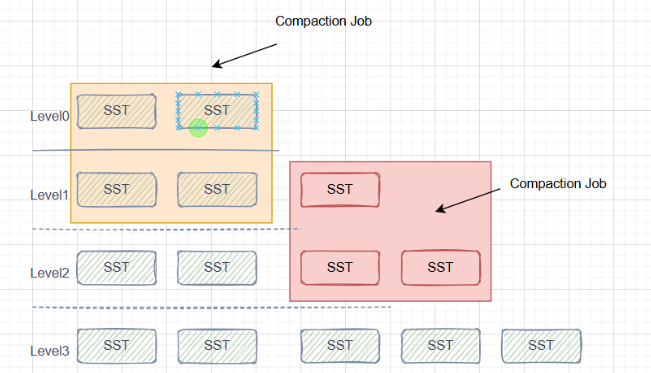
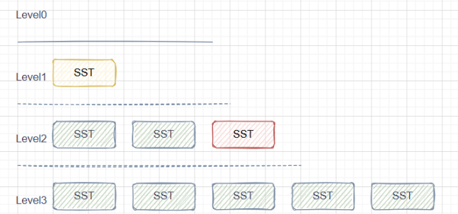
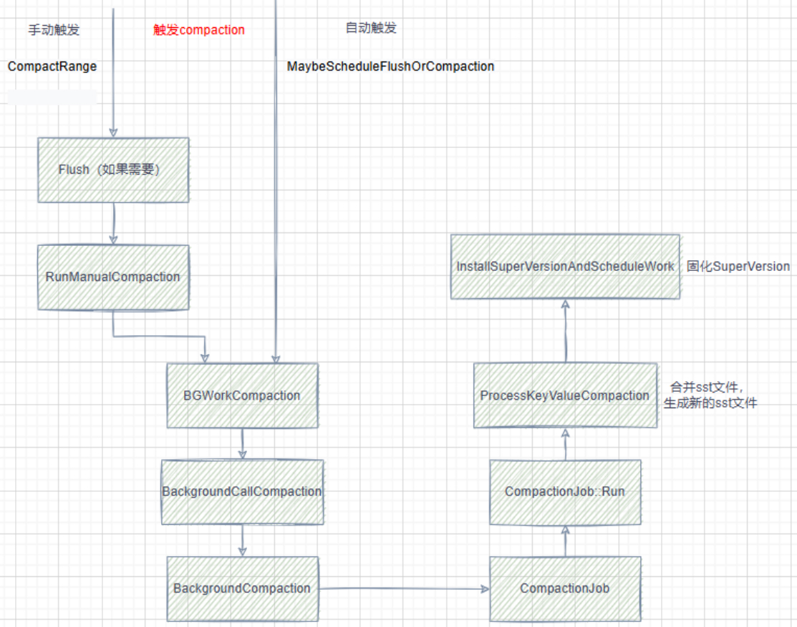

当前笔记参考的作者是dgpp_programer，主要是他的[写性能最强的kv数据库RocksDB全集详解](https://www.bilibili.com/video/BV1vDWseEEys/?spm_id_from=333.999.0.0)系列

本文章同步到我的笔记：[https://github.com/HentaiYang/NoteBooks](https://github.com/HentaiYang/NoteBooks)

## 目录
* [1.Compaction](#p1)
* [2.手动触发Compaction](#p2)
* &nbsp;&nbsp;[2.1.CompactRange & CompactRangeInternal](#p21)
* &nbsp;&nbsp;[2.2.RunManualCompaction](#p22)
* &nbsp;&nbsp;[2.3.CompactRange](#p23)
* [3.自动触发Compaction](#p3)
* &nbsp;&nbsp;[3.1.MaybeScheduleFlushOrCompaction](#p31)
* &nbsp;&nbsp;[3.2.自动触发机制-Score](#p32)
* &nbsp;&nbsp;[3.3.待Compaction文件排序](#p33)

---

# 1.Compaction<a id="p1"></a>

Compaction默认指Major Compaction。

Rocksdb采用追加写方式，对一个key执行插入/删除操作后，该key之前所有的插入操作都没有作用了；对一个key执行Merge更新（增量写入）时，读取时需要读完所有增量才可以返回，同时多个key-增量对也占用了额外空间。

这些情况都造成了写放大/读放大，去除这些重复的key使用的就是compaction操作，从而降低rocksdb的写放大/读放大。

rocksdb的默认compaction策略是Leveled Compaction，涉及数据合并、sst文件生成和删除、版本管理、sst文件选举方式、层级大小计算等，如下图为2个Compaction任务：

<div align="center">  </div>

compaction结束后：

<div align="center">  </div>


Compaction的触发接口包括手动触发和自动触发：
	
	手动触发：CompactRange
	自动触发：MaybeScheduleFlushOrCompaction

<div align="center">  </div>

本文的后半部分将会对Compaction的手动触发和自动触发流程进行介绍，具体执行的Compaction操作会放在下一篇文章中。

---

# 2.手动触发Compaction<a id="p2"></a>

## 2.1.CompactRange & CompactRangeInternal<a id="p2"></a>

接口为CompactRange，用户可以通过该接口手动指定某个范围的key执行compaction，或整个db全量执行compaction。

CompactRange会根据传参确定参数，然后调用CompactRangeInternal函数：

```cpp
Status DBImpl::CompactRange(const CompactRangeOptions& options,
                            ColumnFamilyHandle* column_family,
                            const Slice* begin_without_ts,
                            const Slice* end_without_ts) {
  ...
  // 根据时间戳大小来确认传参
  const Comparator* const ucmp = column_family->GetComparator();
  size_t ts_sz = ucmp->timestamp_size();
  if (ts_sz == 0) {
    return CompactRangeInternal(options, column_family, begin_without_ts,
                                end_without_ts, "" /*trim_ts*/);
  }

  std::string begin_str, end_str;
  auto [begin, end] =
      MaybeAddTimestampsToRange(begin_without_ts, end_without_ts, ts_sz,
                                &begin_str, &end_str, false /*exclusive_end*/);

  return CompactRangeInternal(
      options, column_family, begin.has_value() ? &begin.value() : nullptr,
      end.has_value() ? &end.value() : nullptr, "" /*trim_ts*/);
}
```

进入CompactRangeInternal会首先获取cfd（列族），一次Compaction对一个列族的指定范围进行操作。然后确定系统是否需要Flush。

这里会定义一个很重要的参数exclusive，它表示是否要独占db的compaction，手动触发的默认独占，之后的很多地方会看到对这个参数的判断。

根据选择范围进行compaction、全量compaction（begin和end都是nullptr）等情况，该函数对4种情况分别调用RunManualCompaction方法。

	全量compaction：compaction_style为kCompactionStyleUniversal，且numlevel>1
	L0 or FIFO？：判断universal或FIFO那个，Numlevel<=0或类型为FIFO会用到
	范围compaction：只要first_overlapped_level!=kInvalidLevel，且不是上面那俩就是范围的
	底层compaction：BaseLevelCompaction，有BottommostLevelCompaction判断的那个
	
	
```cpp
Status DBImpl::CompactRangeInternal(const CompactRangeOptions& options,
                                    ColumnFamilyHandle* column_family,
                                    const Slice* begin, const Slice* end,
                                    const std::string& trim_ts) {
  // 获取cfd（在对应列族进行compaction）
  auto cfh = static_cast_with_check<ColumnFamilyHandleImpl>(column_family);
  auto cfd = cfh->cfd();
  // rocksdb可以为不同层级指定不同存储介质
  // 列族每一种介质的路径和大小都存在cf_paths内
  if (options.target_path_id >= cfd->ioptions()->cf_paths.size()) {
    return Status::InvalidArgument("Invalid target path ID");
  }
  bool flush_needed = true;
  ...
  Status s;
  // 全量compaction的begin和end都是nullptr
  // 只要不是全量，就判断memtable中是否包含key范围
  if (begin != nullptr && end != nullptr) {
    UserKeyRange range(*begin, *end);
    SuperVersion* super_version = cfd->GetReferencedSuperVersion(this);
    s = cfd->RangesOverlapWithMemtables(
        {range}, super_version, immutable_db_options_.allow_data_in_errors,
        &flush_needed);
    CleanupSuperVersion(super_version);
  }

  if (s.ok() && flush_needed) {
    // 需要flush就执行flush
    ...
    if (immutable_db_options_.atomic_flush) {
      s = AtomicFlushMemTables(fo, FlushReason::kManualCompaction);
    } else {
      s = FlushMemTable(cfd, fo, FlushReason::kManualCompaction);
	}
	...
  }

  constexpr int kInvalidLevel = -1;
  int final_output_level = kInvalidLevel;
  // 是否要独占db的compaction，手动的默认独占
  bool exclusive = options.exclusive_manual_compaction;
  if (cfd->ioptions()->compaction_style == kCompactionStyleUniversal &&
      cfd->NumberLevels() > 1) {
    ...
	// kCompactionStyleUniversal类型的compaction
	// 传入的input_level为kCompactAllLevels
	// 全量compaction
    s = RunManualCompaction(cfd, ColumnFamilyData::kCompactAllLevels,
                            final_output_level, options, begin, end, exclusive,
                            false /* disable_trivial_move */,
                            std::numeric_limits<uint64_t>::max(), trim_ts);
  } else {
    int first_overlapped_level = kInvalidLevel;
    {
      ...
      bool overlap;
      for (int level = 0;
           level < current_version->storage_info()->num_non_empty_levels();
           level++) {
        overlap = true;
        bool check_overlap_within_file = false;
        if (begin != nullptr && end != nullptr) {
          // Typically checking overlap within files in this case
          check_overlap_within_file = true;
          if (partitioner) {
            // 这里官方有关于partitioner的一大堆注释
            if (!partitioner->CanDoTrivialMove(*begin, *end)) {
              check_overlap_within_file = false;
            }
          }
        }
        ...
        if (!check_overlap_within_file) {
          overlap = current_version->storage_info()->OverlapInLevel(level,
                                                                    begin, end);
        }
        if (overlap) {
          // 获取与compaction范围有重叠的sst文件的最大层数
          first_overlapped_level = level;
          break;
        }
      }
      CleanupSuperVersion(super_version);
    }
    if (s.ok() && first_overlapped_level != kInvalidLevel) {
      if (cfd->ioptions()->compaction_style == kCompactionStyleUniversal ||
          cfd->ioptions()->compaction_style == kCompactionStyleFIFO) {
        ...
      } else {
        assert(cfd->ioptions()->compaction_style == kCompactionStyleLevel);
        uint64_t next_file_number = versions_->current_next_file_number();
        int level = first_overlapped_level;
        final_output_level = level;
        int output_level = 0, base_level = 0;
        for (;;) {
          // Always allow L0 -> L1 compaction
          if (level > 0) {
            if (cfd->ioptions()->level_compaction_dynamic_level_bytes) {
              assert(final_output_level < cfd->ioptions()->num_levels);
              if (final_output_level + 1 == cfd->ioptions()->num_levels) {
                break;
              }
            } else {
              InstrumentedMutexLock l(&mutex_);
              if (final_output_level + 1 >=
                  cfd->current()->storage_info()->num_non_empty_levels()) {
                break;
              }
            }
          }
          output_level = level + 1;
           // 是否让数据快速进入下层，层之间介质不同一般不启用（上层通常快）
          if (cfd->ioptions()->level_compaction_dynamic_level_bytes &&
              level == 0) {
            output_level = ColumnFamilyData::kCompactToBaseLevel;
          }
          // 范围Compaction
          s = RunManualCompaction(
              cfd, level, output_level, options, begin, end, exclusive,
              !trim_ts.empty() /* disallow_trivial_move */,
              std::numeric_limits<uint64_t>::max() /* max_file_num_to_ignore */,
              trim_ts,
              output_level == ColumnFamilyData::kCompactToBaseLevel
                  ? &base_level
                  : nullptr);
          if (!s.ok()) {
            break;
          }
          if (output_level == ColumnFamilyData::kCompactToBaseLevel) {
            assert(base_level > 0);
            level = base_level;
          } else {
            ++level;
          }
          final_output_level = level;
        }
        if (s.ok()) {
          assert(final_output_level > 0);
          // bottommost level intra-level compaction
          if ((options.bottommost_level_compaction ==
                   BottommostLevelCompaction::kIfHaveCompactionFilter &&
               (cfd->ioptions()->compaction_filter != nullptr ||
                cfd->ioptions()->compaction_filter_factory != nullptr)) ||
              options.bottommost_level_compaction ==
                  BottommostLevelCompaction::kForceOptimized ||
              options.bottommost_level_compaction ==
                  BottommostLevelCompaction::kForce) {
            // Use `next_file_number` as `max_file_num_to_ignore` to avoid
            // rewriting newly compacted files when it is kForceOptimized
            // or kIfHaveCompactionFilter with compaction filter set.
            s = RunManualCompaction(
                cfd, final_output_level, final_output_level, options, begin,
                end, exclusive, true /* disallow_trivial_move */,
                next_file_number /* max_file_num_to_ignore */, trim_ts);
          }
        }
      }
    }
  }
  if (!s.ok() || final_output_level == kInvalidLevel) {
    LogFlush(immutable_db_options_.info_log);
    return s;
  }

  if (options.change_level) {
    DisableManualCompaction();
    s = PauseBackgroundWork();
	if (s.ok()) {
  	  // 如果需要将某个层级数据迁移到另外一个层级，则需要暂停集群刷新和压缩
  	  // 然后使用ReFitLevel函数迁移
      s = ReFitLevel(cfd, final_output_level, options.target_level);
      // ContinueBackgroundWork always return Status::OK().
      Status temp_s = ContinueBackgroundWork();
      assert(temp_s.ok());
    }
    EnableManualCompaction();
    TEST_SYNC_POINT(
        "DBImpl::CompactRange:PostRefitLevel:ManualCompactionEnabled");
  }
  // 下刷日志
  LogFlush(immutable_db_options_.info_log);

  {
    InstrumentedMutexLock l(&mutex_);
    // an automatic compaction that has been scheduled might have been
// preempted by the manual compactions. Need to schedule it back.
// 尝试调度自动compaction
    MaybeScheduleFlushOrCompaction();
  }
  return s;
}
```

---
## 2.2.RunManualCompaction<a id="p22"></a>

手动Compaction在确定输入level、输出level、begin、end等参数后，都会调用本函数，首先默认情况下会开启独占，停止或等待所有后台的自动compaction。

然后不断确认手动compaction是否可以执行，并尝试调度CompactRange函数，直到manual.done为true。


```cpp
// 一个层级到下一个层级的compaction
Status DBImpl::RunManualCompaction(
    ColumnFamilyData* cfd, int input_level, int output_level,
    const CompactRangeOptions& compact_range_options, const Slice* begin,
    const Slice* end, bool exclusive, bool disallow_trivial_move,
    uint64_t max_file_num_to_ignore, const std::string& trim_ts,
    int* final_output_level) {
  // 初始化手动compaction信息 ...
  // 添加手动任务，暂时禁用自动compaction，独占db
  AddManualCompaction(&manual);
  TEST_SYNC_POINT_CALLBACK("DBImpl::RunManualCompaction:NotScheduled", &mutex_);
  if (exclusive) {
    // 检查自动执行的任务数
    while (bg_bottom_compaction_scheduled_ > 0 ||
           bg_compaction_scheduled_ > 0) {
      if (manual_compaction_paused_ > 0 || manual.canceled == true) {
        // Pretend the error came from compaction so the below cleanup/error
        // handling code can process it.
        manual.done = true;
        manual.status =
            Status::Incomplete(Status::SubCode::kManualCompactionPaused);
        break;
      }
      TEST_SYNC_POINT("DBImpl::RunManualCompaction:WaitScheduled");
      ROCKS_LOG_INFO(
          immutable_db_options_.info_log,
          "[%s] Manual compaction waiting for all other scheduled background "
          "compactions to finish",
          cfd->GetName().c_str());
      // 等待后台comapciton执行完毕
      bg_cv_.Wait();
    }
  }

  LogBuffer log_buffer(InfoLogLevel::INFO_LEVEL,
                       immutable_db_options_.info_log.get());
  ROCKS_LOG_BUFFER(&log_buffer, "[%s] Manual compaction starting",
                   cfd->GetName().c_str());
  // 出现错误时，也会将manual.done设置为true
  while (!manual.done) {
    manual_conflict = false;
	Compaction* compaction = nullptr;
	// 如果不应该执行手动compaction（shouldnt），或任务被执行，或任务被调度，或没有任务
    if (ShouldntRunManualCompaction(&manual) || (manual.in_progress == true) ||
        scheduled ||
        (((manual.manual_end = &manual.tmp_storage1) != nullptr) &&
         ((compaction = manual.cfd->CompactRange(
               *manual.cfd->GetLatestMutableCFOptions(), mutable_db_options_,
               manual.input_level, manual.output_level, compact_range_options,
               manual.begin, manual.end, &manual.manual_end, &manual_conflict,
               max_file_num_to_ignore, trim_ts)) == nullptr &&
          manual_conflict))) {
      if (!scheduled) {
        // 出现冲突compaction
        if (manual_compaction_paused_ > 0 || manual.canceled == true) {
          // 如果有挂起的手动compaction或当前manual被取消，则返回未完成
          manual.done = true;
          manual.status =
              Status::Incomplete(Status::SubCode::kManualCompactionPaused);
        }
      }
      if (!manual.done) {
        // 没有冲突并且未完成则等待被唤醒
        bg_cv_.Wait();
      }
      // 如果有挂起的手动任务，当前任务被调度且没有被取消调度
      if (manual_compaction_paused_ > 0 && scheduled && !unscheduled) {
        // 取消调度所有手动compaction
        auto unscheduled_task_num = env_->UnSchedule(
            GetTaskTag(TaskType::kManualCompaction), thread_pool_priority);
        if (unscheduled_task_num > 0) {
          // it may unschedule other manual compactions, notify others.
          bg_cv_.SignalAll();
        }
        unscheduled = true;
        TEST_SYNC_POINT("DBImpl::RunManualCompaction:Unscheduled");
      }
      // 未完成状态，等待重新调度
      if (scheduled && manual.incomplete == true) {
        assert(!manual.in_progress);
        scheduled = false;
        manual.incomplete = false;
      }
	} else if (!scheduled) {
  	  // 直到执行manual.cfd->CompactRange后compaction才不为nullptr
      // 否则一直进入if尝试唤醒
      if (compaction == nullptr) {
        manual.done = true;
        if (final_output_level) {
          // No compaction needed or there is a conflicting compaction.
          // Still set `final_output_level` to the level where we would
          // have compacted to.
          *final_output_level = output_level;
          if (output_level == ColumnFamilyData::kCompactToBaseLevel) {
            *final_output_level = cfd->current()->storage_info()->base_level();
          }
        }
        bg_cv_.SignalAll();
        continue;
      }
      // CompactRange已经完成，并且选取了compactin
      ca = new CompactionArg;
      ca->db = this;
      ca->prepicked_compaction = new PrepickedCompaction;
      ca->prepicked_compaction->manual_compaction_state = &manual;
      ca->prepicked_compaction->compaction = compaction;
      // 请求token（限流机制）
      if (!RequestCompactionToken(
              cfd, true, &ca->prepicked_compaction->task_token, &log_buffer)) {
        // Don't throttle manual compaction, only count outstanding tasks.
        assert(false);
      }
      manual.incomplete = false;
      if (compaction->bottommost_level() &&
          env_->GetBackgroundThreads(Env::Priority::BOTTOM) > 0) {
        bg_bottom_compaction_scheduled_++;
        ca->compaction_pri_ = Env::Priority::BOTTOM;
        // 调度执行compaction
        env_->Schedule(&DBImpl::BGWorkBottomCompaction, ca,
                       Env::Priority::BOTTOM,
                       GetTaskTag(TaskType::kManualCompaction),
                       &DBImpl::UnscheduleCompactionCallback);
        thread_pool_priority = Env::Priority::BOTTOM;
      } else {
        bg_compaction_scheduled_++;
        ca->compaction_pri_ = Env::Priority::LOW;
        env_->Schedule(&DBImpl::BGWorkCompaction, ca, Env::Priority::LOW,
                       GetTaskTag(TaskType::kManualCompaction),
                       &DBImpl::UnscheduleCompactionCallback);
        thread_pool_priority = Env::Priority::LOW;
      }
      // 调度之后，scheduled为true，下次while循环会进入if继续阻塞
      scheduled = true;
      TEST_SYNC_POINT("DBImpl::RunManualCompaction:Scheduled");
      if (final_output_level) {
        *final_output_level = compaction->output_level();
      }
    }
  }

  log_buffer.FlushBufferToLog();
  assert(!manual.in_progress);
  assert(HasPendingManualCompaction());
  // 从manual_compaction_dequeue_队列中移除已经执行完成的任务
  RemoveManualCompaction(&manual);
  if (manual.status.IsIncomplete() &&
      manual.status.subcode() == Status::SubCode::kManualCompactionPaused) {
    MaybeScheduleFlushOrCompaction();
  }
  // 尝试唤醒
  bg_cv_.SignalAll();
  return manual.status;
}
```

其中，判断当前能否进行手动compaction使用的方法是ShouldntRunManualCompaction，注意是shouldnt(shouldn't)，因此返回true代表不能执行。

```cpp
// 返回true代表不能执行compaction
bool DBImpl::ShouldntRunManualCompaction(ManualCompactionState* m) {
  if (m->exclusive) {
  // 启用独占db compaction情况下，后台有其他compaction任务也不能执行
    return (bg_bottom_compaction_scheduled_ > 0 ||
            bg_compaction_scheduled_ > 0);
  }
  std::deque<ManualCompactionState*>::iterator it =
      manual_compaction_dequeue_.begin();
  bool seen = false;
  while (it != manual_compaction_dequeue_.end()) {
    if (m == (*it)) {
      ++it;
      seen = true;
      continue;
} else if (MCOverlap(m, (*it)) && (!seen && !(*it)->in_progress)) {
  // 如果多个手动compaction存在key重叠，则也不能执行
      return true;
    }
    ++it;
  }
  return false;
}
```

---
## 2.3.CompactRange<a id="p23"></a>
CompactRange会经过两层调用，第一层先确认参数，然后通过compaction_picker_创建compaction任务：
```cpp
ompaction* ColumnFamilyData::CompactRange(
    const MutableCFOptions& mutable_cf_options,
    const MutableDBOptions& mutable_db_options, int input_level,
    int output_level, const CompactRangeOptions& compact_range_options,
    const InternalKey* begin, const InternalKey* end,
    InternalKey** compaction_end, bool* conflict,
uint64_t max_file_num_to_ignore, const std::string& trim_ts) {
  // 通过compaction_picker_创建一个compaction
  auto* result = compaction_picker_->CompactRange(
      GetName(), mutable_cf_options, mutable_db_options,
      current_->storage_info(), input_level, output_level,
      compact_range_options, begin, end, compaction_end, conflict,
      max_file_num_to_ignore, trim_ts);
  if (result != nullptr) {
    result->FinalizeInputInfo(current_);
  }
  TEST_SYNC_POINT("ColumnFamilyData::CompactRange:Return");
  return result;
}
```

第二层则进行compaction任务的初始化和注册，通过GetOverlappingInputs获取所有和范围有重叠key的sst，并确认有L0时，L0仅参与当前compaction。

然后确认input file和output file，扩展得到清晰边界，最后保证所有文件都仅参与当前compaction，并且与非独占线程不冲突后， 创建并注册一个Compaction对象，并重新计算每一层的compaction score（之后会讲到）。

这样就完成了手动Compaction任务的创建和注册，等待系统中的调度。

```cpp
Compaction* CompactionPicker::CompactRange(
    const std::string& cf_name, const MutableCFOptions& mutable_cf_options,
    const MutableDBOptions& mutable_db_options, VersionStorageInfo* vstorage,
    int input_level, int output_level,
    const CompactRangeOptions& compact_range_options, const InternalKey* begin,
    const InternalKey* end, InternalKey** compaction_end, bool* manual_conflict,
    uint64_t max_file_num_to_ignore, const std::string& trim_ts) {
  // CompactionPickerFIFO has its own implementation of compact range
  assert(ioptions_.compaction_style != kCompactionStyleFIFO);
  // 在kCompactionStyleUniversal模式下进入该if
  if (input_level == ColumnFamilyData::kCompactAllLevels) {
    ......
     Compaction* c = new Compaction(......);
    RegisterCompaction(c);
    vstorage->ComputeCompactionScore(ioptions_, mutable_cf_options);
    return c;
  }

  CompactionInputFiles inputs;  // 选取输入文件
  inputs.level = input_level;  // 输入层级
  bool covering_the_whole_range = true;

  // All files are 'overlapping' in universal style compaction.
  // We have to compact the entire range in one shot.
  if (ioptions_.compaction_style == kCompactionStyleUniversal) {
    begin = nullptr;
    end = nullptr;
  }
  // 获取input_level中所有与begin和end有重叠的sst文件，并翻入inputs.files
  // L0采用遍历查找，L1及以上二分查找
  vstorage->GetOverlappingInputs(input_level, begin, end, &inputs.files);
  if (inputs.empty()) {
    return nullptr;
  }
  // 检测L0是否冲突，因为L0同时只能参与一个compaction
  if ((input_level == 0) && (!level0_compactions_in_progress_.empty())) {
    // Only one level 0 compaction allowed
    TEST_SYNC_POINT("CompactionPicker::CompactRange:Conflict");
    *manual_conflict = true;
    return nullptr;
  }

  // 限流，单次compaction字节数限制max_compaction_bytes
  if (input_level > 0) {
    const uint64_t limit = mutable_cf_options.max_compaction_bytes;
    uint64_t input_level_total = 0;
    int hint_index = -1;
    InternalKey* smallest = nullptr;
    InternalKey* largest = nullptr;
    for (size_t i = 0; i + 1 < inputs.size(); ++i) {
      if (!smallest) {
        smallest = &inputs[i]->smallest;
      }
      largest = &inputs[i]->largest;

      uint64_t input_file_size = inputs[i]->fd.GetFileSize();
      uint64_t output_level_total = 0;
      if (output_level < vstorage->num_non_empty_levels()) {
        std::vector<FileMetaData*> files;
        vstorage->GetOverlappingInputsRangeBinarySearch(
            output_level, smallest, largest, &files, hint_index, &hint_index);
        for (const auto& file : files) {
          output_level_total += file->fd.GetFileSize();
        }
      }

      input_level_total += input_file_size;

      if (input_level_total + output_level_total >= limit) {
        covering_the_whole_range = false;
        // 如果超过limit，则对文件进行resize
        inputs.files.resize(i + 1);
        break;
      }
    }
  }
  ...
  InternalKey key_storage;
  InternalKey* next_smallest = &key_storage;
  // 根据inputs中的文件扩展出当前level的一个清晰边界
  // 根据这些sst文件的最小key和最大key进行扩展，和前面传入的begin和end有区别
  if (ExpandInputsToCleanCut(cf_name, vstorage, &inputs, &next_smallest) ==
      false) {
    // manual compaction is now multi-threaded, so it can
    // happen that ExpandWhileOverlapping fails
    // we handle it higher in RunManualCompaction
    *manual_conflict = true;
    return nullptr;
  }

  if (covering_the_whole_range || !next_smallest) {
    *compaction_end = nullptr;
  } else {
    **compaction_end = *next_smallest;
  }

  CompactionInputFiles output_level_inputs;
  if (output_level == ColumnFamilyData::kCompactToBaseLevel) {
    assert(input_level == 0);
    output_level = vstorage->base_level();
    assert(output_level > 0);
  }
  output_level_inputs.level = output_level;
  if (input_level != output_level) {
	int parent_index = -1;
	// 在output_level查找重叠的sst文件，内部逻辑和查找input_level相似
    if (!SetupOtherInputs(cf_name, vstorage, &inputs, &output_level_inputs,
                          &parent_index, -1)) {
      // manual compaction is now multi-threaded, so it can
      // happen that SetupOtherInputs fails
      // we handle it higher in RunManualCompaction
      *manual_conflict = true;
      return nullptr;
    }
  }
  // 将input_level和output_level的文件都放入compaction_inputs
  std::vector<CompactionInputFiles> compaction_inputs({inputs});
  if (!output_level_inputs.empty()) {
    compaction_inputs.push_back(output_level_inputs);
  }
  for (size_t i = 0; i < compaction_inputs.size(); i++) {
    // 判断每个文件是否正在参与compaction
    if (AreFilesInCompaction(compaction_inputs[i].files)) {
      *manual_conflict = true;
      return nullptr;
    }
  }
  // 对于2个没有开启独占db的compaction，判断当前compaction的最小key和最大key
  // 是否和compactions_in_progress_中相同output level的key有范围重叠
  // 是的话要暂停当前compaction
  if (FilesRangeOverlapWithCompaction(
          compaction_inputs, output_level,
          Compaction::EvaluatePenultimateLevel(vstorage, ioptions_, input_level,
                                               output_level))) {
    // This compaction output could potentially conflict with the output
    // of a currently running compaction, we cannot run it.
    *manual_conflict = true;
    return nullptr;
  }

  std::vector<FileMetaData*> grandparents;
  // 获取input和output中所有的sst文件的最小key和最大key
  // 在output level + 1级别查找重叠的sst，将其放入到grandparents
  GetGrandparents(vstorage, inputs, output_level_inputs, &grandparents);
  // 已经计算完一个compaction需要的数据，创建一个compaction
  Compaction* compaction = new Compaction(
      vstorage, ioptions_, mutable_cf_options, mutable_db_options,
      std::move(compaction_inputs), output_level,
      MaxFileSizeForLevel(mutable_cf_options, output_level,
                          ioptions_.compaction_style, vstorage->base_level(),
                          ioptions_.level_compaction_dynamic_level_bytes),
      mutable_cf_options.max_compaction_bytes,
      compact_range_options.target_path_id,
      GetCompressionType(vstorage, mutable_cf_options, output_level,
                         vstorage->base_level()),
      GetCompressionOptions(mutable_cf_options, vstorage, output_level),
      Temperature::kUnknown, compact_range_options.max_subcompactions,
      std::move(grandparents), /* is manual */ true, trim_ts, /* score */ -1,
      /* deletion_compaction */ false, /* l0_files_might_overlap */ true,
      CompactionReason::kUnknown,
      compact_range_options.blob_garbage_collection_policy,
      compact_range_options.blob_garbage_collection_age_cutoff);

  TEST_SYNC_POINT_CALLBACK("CompactionPicker::CompactRange:Return", compaction);
  // 注册到compactions_in_progress_
  RegisterCompaction(compaction);

  // Creating a compaction influences the compaction score because the score
  // takes running compactions into account (by skipping files that are already
  // being compacted). Since we just changed compaction score, we recalculate it
  // here
  // 重新计算每一层的score
  vstorage->ComputeCompactionScore(ioptions_, mutable_cf_options);

  return compaction;
}
```
---
# 3.自动触发Compaction<a id="p3"></a>
## 3.1.MaybeScheduleFlushOrCompaction<a id="p31"></a>

在Flush中有介绍此函数，rocksdb内部多处会调用MaybeScheduleFlushOrCompaction，以自动触发Compaction，使用LOW线程执行。

```cpp
void DBImpl::MaybeScheduleFlushOrCompaction() {
  ...
  // 如果有可以调度的compaction，并且总任务数小于上限，则用LOW线程执行compaction
  while (bg_compaction_scheduled_ + bg_bottom_compaction_scheduled_ <
             bg_job_limits.max_compactions &&
         unscheduled_compactions_ > 0) {
    CompactionArg* ca = new CompactionArg;
    ca->db = this;
    ca->compaction_pri_ = Env::Priority::LOW;
    ca->prepicked_compaction = nullptr;
    bg_compaction_scheduled_++;
    unscheduled_compactions_--;
    env_->Schedule(&DBImpl::BGWorkCompaction, ca, Env::Priority::LOW, this,
                   &DBImpl::UnscheduleCompactionCallback);
  }
}
```

---
## 3.2.自动触发机制-Score<a id="p32"></a>
rocksdb内部根据各个列族每一层的score值来决定是否需要执行compaction和执行的顺序：score大于1代表需要执行compaction，score越大越先执行（在新版本中，增加了其他参数以更加灵活地调整优先级）。
每个列族的sst呈现LSM结构，每层都会有一个大小。

**每层容纳数据的计算方式：**

	max_bytes_for_level_base：L0和L1层能承载的字节数
	max_bytes_for_level_multiplier：倍数
	level_compaction_dynamic_level_bytes：
		开启该开关后，数据优先落入到最下层，空间放大最小（同一存储介质下才会打开）
	max_bytes_for_level_multiplier_additional：单独对某一层新增倍数

```cpp
if (level_compaction_dynamic_level_bytes):
	L(n+1) = (Ln * max_bytes_for_level_multiplier);
else:
	L(n+1) = (Ln * max_bytes_for_level_multiplier) * 
	max_bytes_for_level_multiplier_additional[n];
```

例：关闭优先落入下层、单独倍数时：

	max_bytes_for_level_base=1024*1024*1024; 
	max_bytes_for_level_multiplier=10
	L0=1G, L1=1G, L2=10G, L3=100G, L4=1000G... 

**每层score的计算方式：**

	Score = 当前层级的数据大小 / 当前层级理论可以承载的数据大小

L0的score计算比较特殊，新增了sst文件个数计算score，然后取两种方式的最大值：

	level0_file_num_compaction_trigger：触发L0进行compaction的配置阈值
	score = 当前L0未参与compaction的sst文件个数 / level0_file_num_compaction_trigger
	score = max(文件个数计算的score, L0数据量计算的score)

Score计算代码：

```cpp
void VersionStorageInfo::ComputeCompactionScore(
    const ImmutableOptions& immutable_options,
    const MutableCFOptions& mutable_cf_options) {
  double total_downcompact_bytes = 0.0;
  // 目前数据量计算阈值仍为1.0，但优先级由更多因素决定
  // 现在当比值为1.0以上时会乘以10，用来根据其他因素调整优先级
  const double kScoreScale = 10.0;
  int max_output_level = MaxOutputLevel(immutable_options.allow_ingest_behind);
  for (int level = 0; level <= MaxInputLevel(); level++) {
    double score;
    if (level == 0) {
      // 目前L0用文件数score代替了数据量score
      int num_sorted_runs = 0;
      uint64_t total_size = 0;
      for (auto* f : files_[level]) {
        // 统计文件总大小
        total_downcompact_bytes += static_cast<double>(f->fd.GetFileSize());
        if (!f->being_compacted) {
          // compensated_file_size是一个估算的值，把无效key也算进去了
          total_size += f->compensated_file_size;
          num_sorted_runs++;
        }
      }
      if (compaction_style_ == kCompactionStyleUniversal) {
        ...
      }
      if (compaction_style_ == kCompactionStyleFIFO) {
        ...
      } else {
        // score=L0未参与compaction的文件总个数 / 配置的文件数阈值
        score = static_cast<double>(num_sorted_runs) /
                mutable_cf_options.level0_file_num_compaction_trigger;
        if (compaction_style_ == kCompactionStyleLevel && num_levels() > 1) {
          // 层次化压缩，可能进行L0->L0的压缩，L0文件过大会导致迁移到LBase开支过大
           // L0score过高会让L0->LBase始终优先LBase->LBase+1，导致LBase堆积数据
           // L0score过低会在L0积累过多文件
          if (immutable_options.level_compaction_dynamic_level_bytes) {
             // 启用动态层级大小判断（数据直接落到最底层）
            if (total_size >= mutable_cf_options.max_bytes_for_level_base) {
              // 数据量超过阈值时，保证score超过阈值
              score = std::max(score, 1.01);
            }
            if (total_size > level_max_bytes_[base_level_]) {
              // 当数据量超过基础层时，更新score为L0数据量/LBase数据量（取最大）
               // 确保L0压缩优先级更高
              uint64_t base_level_size = 0;
              for (auto f : files_[base_level_]) {
                base_level_size += f->compensated_file_size;
              }
              score = std::max(score, static_cast<double>(total_size) /
                                          static_cast<double>(std::max(
                                              base_level_size,
                                              level_max_bytes_[base_level_])));
            }
            if (score > 1.0) {
              // score超过1.0，则默认放大10倍
              score *= kScoreScale;
            }
          } else {
            // 未启用动态层级大小调整，则对比数据量score和文件数score
            score = std::max(score,
                             static_cast<double>(total_size) /
                                 mutable_cf_options.max_bytes_for_level_base);
          }
        }
      }
    } else {  // level > 0
      // Compute the ratio of current size to size limit.
      uint64_t level_bytes_no_compacting = 0;
      uint64_t level_total_bytes = 0;
      // 遍历所有文件，计算数据量
      for (auto f : files_[level]) {
        level_total_bytes += f->fd.GetFileSize();
        if (!f->being_compacted) {
          level_bytes_no_compacting += f->compensated_file_size;
        }
      }
      if (!immutable_options.level_compaction_dynamic_level_bytes) {
        // 没启用动态层级大小调整，则直接计算数据量score
        score = static_cast<double>(level_bytes_no_compacting) /
                MaxBytesForLevel(level);
      } else {
         // 启用了，就判断数据量是否超过当前层级上限
        if (level_bytes_no_compacting < MaxBytesForLevel(level)) {
           // 没超过当前层级上限，就正常计算
          score = static_cast<double>(level_bytes_no_compacting) /
                  MaxBytesForLevel(level);
        } else {
          // 即将接收大量数据，降低优先级
          score = static_cast<double>(level_bytes_no_compacting) /
                  (MaxBytesForLevel(level) + total_downcompact_bytes) *
                  kScoreScale;
        }
        // 非必要层，通过调整，使其略低于L0的压缩需求
        if (level_bytes_no_compacting > 0 &&
            level <= lowest_unnecessary_level_) {
          score = std::max(
              score, kScoreScale *
                         (1.001 + 0.001 * (lowest_unnecessary_level_ - level)));
        }
      }
      if (level <= lowest_unnecessary_level_) {
      // 小于或低于不必要的最低层级，则即将被压缩到下一层，用在动态层级大小调整，降低优先级
        total_downcompact_bytes += level_total_bytes;
      } else if (level_total_bytes > MaxBytesForLevel(level)) {
        total_downcompact_bytes +=
            static_cast<double>(level_total_bytes - MaxBytesForLevel(level));
      }
}
// 将每一层的score存放在compaction_score_
    compaction_level_[level] = level;
    compaction_score_[level] = score;
  }

  // 将所有score从大到小排序
  for (int i = 0; i < num_levels() - 2; i++) {
    for (int j = i + 1; j < num_levels() - 1; j++) {
      if (compaction_score_[i] < compaction_score_[j]) {
        double score = compaction_score_[i];
        int level = compaction_level_[i];
        compaction_score_[i] = compaction_score_[j];
        compaction_level_[i] = compaction_level_[j];
        compaction_score_[j] = score;
        compaction_level_[j] = level;
      }
    }
  }
  // 对于一些特殊条件需要compaction的sst文件，将其放入files_marked_for_compaction_
  ComputeFilesMarkedForCompaction(max_output_level);
  // 对于最底层需要进行压缩的sst文件，将其放入bottommost_files_marked_for_compaction_
  ComputeBottommostFilesMarkedForCompaction(
      immutable_options.allow_ingest_behind);
  // 生命周期过期的sst文件，将其放入到expired_ttl_files_
  ComputeExpiredTtlFiles(immutable_options, mutable_cf_options.ttl);
  // 放入files_marked_for_periodic_compaction_
  ComputeFilesMarkedForPeriodicCompaction(
      immutable_options, mutable_cf_options.periodic_compaction_seconds,
      max_output_level);
  // 标记强制垃圾回收的，放进files_marked_for_forced_blob_gc_
  ComputeFilesMarkedForForcedBlobGC(
      mutable_c f_options.blob_garbage_collection_age_cutoff,
      mutable_cf_options.blob_garbage_collection_force_threshold,
      mutable_cf_options.enable_blob_garbage_collection);
  // 预估需要参与compaction的数据大小
  EstimateCompactionBytesNeeded(mutable_cf_options);
}
```
---

## 3.3.待Compaction文件排序<a id="p33"></a>

```python
// 每次compaction都需要选取sst文件，这些需要compaction的sst文件会
// 按照compaction_pri排序，然后放入到files_by_compaction_pri_内
// PickFileToCompact时会从中获取sst文件
void VersionStorageInfo::UpdateFilesByCompactionPri(
    const ImmutableOptions& ioptions, const MutableCFOptions& options) {
  if (compaction_style_ == kCompactionStyleNone ||
      compaction_style_ == kCompactionStyleFIFO ||
      compaction_style_ == kCompactionStyleUniversal) {
    // 这些类型不需要Update
    return;
  }
  // No need to sort the highest level because it is never compacted.
  for (int level = 0; level < num_levels() - 1; level++) {
    const std::vector<FileMetaData*>& files = files_[level];
    auto& files_by_compaction_pri = files_by_compaction_pri_[level];
    assert(files_by_compaction_pri.size() == 0);

    // populate a temp vector for sorting based on size
    std::vector<Fsize> temp(files.size());
    for (size_t i = 0; i < files.size(); i++) {
      temp[i].index = i;
      temp[i].file = files[i];
}

    // sort the top number_of_files_to_sort_ based on file size
    size_t num = VersionStorageInfo::kNumberFilesToSort;
    if (num > temp.size()) {
      num = temp.size();
}
// 按照compaction_pri排序sst文件
switch (ioptions.compaction_pri) {
  // delete key优先，无效key越多越往前
      case kByCompensatedSize:
        std::partial_sort(temp.begin(), temp.begin() + num, temp.end(),
                          CompareCompensatedSizeDescending);
        break;
      // largest_seqno优先
      case kOldestLargestSeqFirst:
        std::sort(temp.begin(), temp.end(),
                  [](const Fsize& f1, const Fsize& f2) -> bool {
                    return f1.file->fd.largest_seqno <
                           f2.file->fd.largest_seqno;
                  });
        break;
      // smallest_seqno优先
      case kOldestSmallestSeqFirst:
        std::sort(temp.begin(), temp.end(),
                  [](const Fsize& f1, const Fsize& f2) -> bool {
                    return f1.file->fd.smallest_seqno <
                           f2.file->fd.smallest_seqno;
                  });
        break;
      // 与下一层sst文件重叠最小的优先（减少写放大？），默认策略
      case kMinOverlappingRatio:
        SortFileByOverlappingRatio(*internal_comparator_, files_[level],
                                   files_[level + 1], ioptions.clock, level,
                                   num_non_empty_levels_, options.ttl, &temp);
        break;
      // 轮询排序，在多个文件之间均匀分配读写操作
      case kRoundRobin:
        SortFileByRoundRobin(*internal_comparator_, &compact_cursor_,
                             level0_non_overlapping_, level, &temp);
        break;
      default:
        assert(false);
    }
assert(temp.size() == files.size());

    // initialize files_by_compaction_pri_
    for (size_t i = 0; i < temp.size(); i++) {
      files_by_compaction_pri.push_back(static_cast<int>(temp[i].index));
    }
    next_file_to_compact_by_size_[level] = 0;
    assert(files_[level].size() == files_by_compaction_pri_[level].size());
  }
}
```

---

对触发流程的介绍到这里就结束了，无论是手动Compaction还是自动Compaction，创建Compaction任务后都会调用BGWorkCompaction，具体Compaction的执行流程将在下一篇文章介绍。